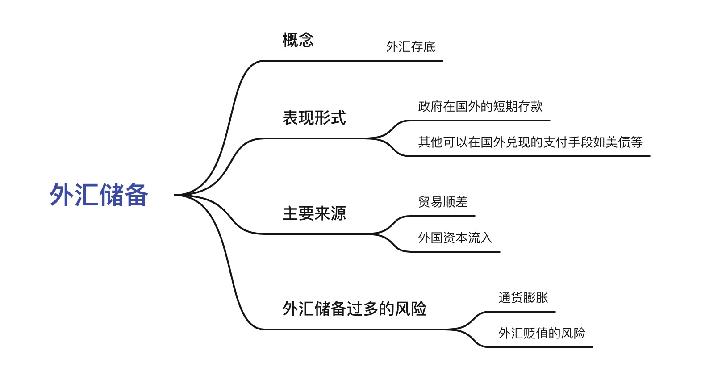

# 基础知识
## 中央银行

::: tip 什么是中央银行？
我国的中央银行，全称叫做 **【中国人民银行】**，我们平时在一些财经文章里或视频中看到听到 **【央行】**,  <b>【央妈】</b>就是它。
:::

**顺便提醒一下**

`中国银行`和`中国人民银行`并不是一回事，四大行之一的`中国银行`，就是普通的商业银行，并不是`中央银行`，和商业银行不同的是，`中央银行`是一个国家机构,
它主要是调控国家的宏观经济，监管金融市场，保证国家金融制度的良好运行。一个国家只会有一个中央银行。而美国的中央银行，全称叫做**美国联邦储备系统**，
我们经常在财经新闻，短视频上看到的 <b>【美联储】</b>就是它

**央行的职能**

**1、印钞、发行货币**

只有央行有权利印钞，发行货币，其他商业银行都没有发行货币的权利。

**2、与其他商业银行进行存、贷、拆借等业务**

央行是不受理个人业务的，它的主要业务对象是其他商业银行或者金融机构

<b>业务1：集中收取存放所有商业银行的存款准备金</b>

至于什么是存款准备金，以及为什么要收这个准备金点击这里[<a href="#zbj">前往</a>]

<b>业务2：为商业银行做最后贷款人</b>

当商业银行把钱都贷出去了，而这时如果很多储户都来取钱，商业银行里的钱又不够，银行的信任就会出现问题，这时
央行就会贷款给商业银行，帮忙兜底

<b>业务3：处理全国商业银行的票据清算</b>

每一家商业银行在央行都有一个自己的独立账户，我们平时跨行转账时，收付的票据以及资金清算这些数据最终都会传到央行统一处理，
知道大概就行。

**3、作为政府的银行**

比如代理国库的收支，以及代理政府债券的发行，为政府提供贷款，保管国家的黄金，以及管理外汇储备（<a href="#whcb">了解外汇储备</a>）等

除了以上三大基本职能之外，央行还承担了监管其他商业银行，以及制定调整货币政策的职责

比如调节市场利率，管控汇率（`两种货币之间兑换的比率`）

## 存款准备金、存款准备金率、降准、升准

商业银行等金融机构必须把一部分居民存入银行的前缴存在央行，而放在央行的这部分前就叫做`存款准备金`。
存在央行的这笔钱占商业银行等金融机构所有存款总额的比例就叫做`存款准备金率`。例如存`款准备金率`为10%，
居民每在商业银行存款100元，商业银行就必须在央行存10元的`存款准备金`，另外的90元才能作为贷款放出去。
最后这`降准`也就不难理解，就是降低存款准备金率，`升准`正好与降准相反

**存款准备金的作用**

存款准备金是货币政策不可缺少的一部分，所有金融机构不能将获取的存款全部用于放贷，必须保留一部分资金用于用户
存取结算使用，避免银行产生系统性风险，导致金融秩序混乱，有利于保证金融机构对所有用户的正常支付。央行通过调节
存款准备金率来控制所有金融机构的贷款规模以及货币供应量，存款准备金率降低时（`降准`），相关金融机构就能放出更多的
贷款，市场货币供应量增加，存款准备金率升高时（`升准`），相关金融机构用在放贷的资金就减少，市场货币供应量也就减少了。

## 外汇储备

外汇储备（Foreign Exchange Reserve）又称为外汇存底。

是指为了应付国际支付的需要， 各国的央行及其他政府机构所集中掌握并可以随时兑换成外国货币的外汇资产。

通俗的理解就是我们要买外国的石油，高科技产品。不能用人民币来支付。

我们拿人民币去支付，有不少国家不认。（目前已经有一些国家认可人民币支付，但人民币现在还不是主流）

目前国际上主要认可的货币是美元，所以我们要准备足够的美元资产，来应付国际间的交易

如果没有足够的外汇储备，会导致国际间的支付非常困难。

**外汇储备的具体形式有：**

1. 政府在国外的短期存款（我国存在国外的美元或欧元等国际支付主要货币）

2. 其他可以在国外兑现的手段，如外国的有价证券，外国银行的支票、期票、外币汇票等，大家熟知的是美国国债

当国际收支出现逆差时，必须动用外汇储备来保持国际收支平衡

**外汇储备的主要来源有两种：**
1. 贸易顺差
2. 资本流入 （外商在国内投资）

**外汇储备不是越多越好**

主要原因如下：
1. 外汇储备过多，容易导致通货膨胀

因为在国内是不能用外汇支付的，国内的外贸商人，企业等转到的外汇需要到央行兑换成等额的人民币，然后在国内花销。

外汇储备越多，兑换出来的人民币也就越多，流通在国内市场的人民币过多，就会有通货膨胀的风险。

2. 外汇贬值的风险

那些主要外汇国家（主要老美这个流氓），都有大量发行货币放水的冲动。

美元大放水就会导致持有美元的国家手中的外汇贬值。

持有的美元外汇越多，贬值带来的损失也就越多。

**总结**

## 贸易顺差、贸易逆差

`贸易顺差`是指一个国家或地区，在一定时间内向国外出口的商品总值超出了从国外进口的商品总值。

贸易顺差又被称为`出超`，`贸易黑字`

**贸易顺差的影响**

贸易顺差并不是越多越好，过高的贸易顺差是一件非常危险的事，意味着本国经济增长比过去任何时候都更依赖外部需求，
对外依存度过高。巨额的贸易顺差也带来了外汇储备的膨胀，给货币带来了升值压力，也给国际上贸易保护主义势力落下口实，
认为巨额顺差反应的是货币被低估。这增加了货币升值压力和金融风险，为货币汇率机制改革增加了成本和难度

* * *

`贸易逆差`是指一个国家或地区，在一定时间内从国外进口的商品总值超出了向国外出口的商品总值

贸易逆差又被称为`贸易赤字`或`入超`

**贸易逆差的影响**

当一个国家出现贸易逆差时，即表示该国外汇储备减少，其商品国际竞争力削弱，该国在该时期内的对外贸易处于不利位置，
大量的贸易逆差将使国内资源外流加剧，外债增加，影响国民经济的正常有效运行。因此，政府会设法避免长期贸易逆差。
如果一个国家出现贸易赤字现象，为了支付进口的债务，必须在市场上卖出本币以购买他国货币来支付出口国的债务，这样
居民收入变会流出国外，使国家经济表现转弱。

## 通货膨胀

::: tip 通货膨胀的原理其实很简单
就是指货币的发行量超过了商品流通实际需要的货币数量，从而引起的货币贬值
:::

简单的来讲，就是社会上的钱变多了，所以钱变的没那么值钱了。

当我们想知道通胀率是多少，一般有点经济意识的都知道去看CPI[<a href="#cpi">什么是CPI？</a>]
CPI一般在每个月9号发布，在国家统计局[<a href="https://www.stats.gov.cn/sj/">前往</a>]的官网查看，
通过看CPI的涨幅，就可以就可以大致反应外国的通胀率，其实也就是官方发布的通胀数据。

如果根据CPI看的话过去十几年我国每年的平均通胀率只有3%点几

如果想知道一个国家的真实通胀率就是用`M2增长率` - `GDP增长率`

（什么是M2[<a href="#m2">查看</a>?什么是GDP[<a href="#GDP">查看</a>]）

就可以得到更加真实的整体通胀率

当我们要更深入的去理解通胀，你会发现它比我们所看见的其实要更加复杂

因为在实际的过程中，钱这个东西是流动的，只有当钱流到流到某一个市场的时候，这个市场的东西才会涨价

比如流到了汽车市场，汽车就会涨价，流到的生活用品市场生活用品就会涨价。

所以在真实的情况中，每一个市场的通胀都是不一样的

有些市场会通胀的比较厉害，而有些市场的通胀则比较轻微。

直接在国家统计局的官网就能够看到每一个不同的商品品类，相较于去年，或者相较于上个月，涨价了多少。也可以看到所有的这些商品品类，整体上涨了多少。
CPI的数据是准确的，我们平时买的猪肉，大米，以及生活用品，确实只涨了这么多。

CPI确实能够反映出市场的通胀率，这是对的，但是，它只能反映出一部分，因为各国的CPI，往往没有把金融资产这一项计算在内

而现实中最大的通胀，往往就发生在这个领域

而这个领域往往又是最容易被大家忽略的，因为大家往往意识不到那是通胀。

而这种金融资产的通胀，在我国的载体则是房子

从08年到现在我国的房地产价的大幅上涨，这背后很大一部分原因，其实也是因为通胀

**为什么我国的通胀则是在楼市呢？**

首先央行印钞，然后央行把钱，放给商业银行，商业银行拿到钱以后，再把钱拿去给企业或者个人放贷，这样钱就到了市场上。

在真实的情况中，社会上大部分增发钱，其实并不是都由央行印出来的，商业银行同样也可以创造货币。(通过信贷)

假如现在商业银行里一分钱就都没有，而这个时候你存了100元现金在银行里，你的银行的账户里就有了100元存款。

商业银行每收到一笔存款，都要拿出一部分放在央行而存在央行的这部分钱就叫做<b>「存款准备金」</b>，而存放的比例，就叫做<b>「存款准备金率」</b>

这里我们假设存款准备金率是10%

那么按照这个比例，你现在存的这100元，商业银行就要放10块钱在央行，那么剩下的90元商业银行就可以拿去放贷。

就这样循环到最后你会发现

最初你存进去的100元，经过商业的银行不断的放贷操作，最终扩张10倍！

变成了 1000元！

这个倍数就叫做<b>「货币乘数」</b>

而这1000元里面，只有你最开始存进去的那100元才是真正的纸币，所以这100元，我们称之为<b>「基础货币」</b>

而剩下的那900元，就只是个数字而已，并没有对应的纸币，这种没有纸币对应的钱，我们称之为<b>「派生货币」</b>

(所以M2[<a href="#m2">查看</a>]，是由全社会所有的`基础货币`，和`派生货币`加在一起的总量)

以上这个小例子就是商业银行如何增发货币的具体过程

现在知道了，在我国信贷扩张才是货币增发的源头。
而我们最大的信贷源头毋庸置疑是房地产，
过去这么多年贷款最多就是房企，和居民购房贷款

大部分人赚到钱之后，又继续拿这些钱去买房子了

以及持有多套房产的群体收入也会增加，收入增加，家庭消费支出也会随之增加，钱就会传导到其他消费市场，结果应该是整个市场一起发生通胀。

这样就形成了一个循环，因为房价不断上涨，所以大部分人又都把钱拿去买房子，大量资金不断涌入楼市

这样钱就不断的在房地产这个行业来回循环，所以长久下来就造成这个领域的通胀比任何市场都要大。

## 加息、降息

`加息`属于国家经济宏观调控手段，指的是中央银行提高了基础利率。加息意味着市场上银行存款利率上升，货币供应相应减少回流，对于消费是起到抑制作用。加息可以对通货膨胀的现象进行控制，同时也会引起货币升值，由于市场利率的提高，还会对股票、楼市等投资行为产生降温影响。

**加息的影响**

加息意味着市场降温，从长期预期层面来看，存款的收益变高，贷款所产生的利息相应变多，会抑制消费与投资市场的热情。投资者面对加息情况，可以选择收紧个人的投资策略，减少投机性投资的比例，采取长期的价值投资策略，或者选择银行存款等长期理财产品，作保值操作。普通投资人对于加息的讯号应当重视，合理配置资产，购入一些生活必备品以应对物价上涨，尽可能减少高风险投资，部分企业也会面临贷款难，资金链破裂的风险。

***

`降息`是指银行利用利率调整，来改变现金流动的金融方式。当银行降息时，于金融机构而言，放贷利率下降，融资者的成本降低；于普通个人而言，把资金存入银行的收益减少，所以降息会导致资金从银行流出，存款变为投资或消费，结果是资金流动性增加。

一般来说，降息会给股票市场带来更多的资金，因此有利于股价上涨。降息会刺激房地产业发展。降息会推动企业贷款扩大再生产，鼓励消费者贷款购买大件商品，使经济逐渐变热。自2014年11月22日起下调金融机构人民币贷款和存款基准利率。

## 缩表、扩表

## GDP

国内生产总值
> 简单的来说就是我们整个国家的人，消费掉的钱的总和。

<!-- 

 -->

## <b id="m2">M2</b>

> 简单的来说就是市场上流动的钱和银行里的钱的总和

由全社会所有的`基础货币`，和`派生货币`加在一起的总量
## CPI

::: tip CPI就是消费者物价指数
是一个用来反应大众常用的商品价格变动的指标，比如食品，烟酒，衣服，生活用品，医疗，交通这些，我们通过
看CPI的变动，就能看到这些我们常常用的消费品的价格变化。
:::

我国的CPI下分了八大类，分别是：食品烟酒、衣着、居住、交通通信、教育文化和娱乐、医疗保健、生活用品及服务、以及其他用品和服务。

## PPI

PPI(`生产者物价指数`)一般指工业品出厂价格指数

>工业品出厂价格指数是反映一定时期内全部工业产品出厂价格总水平的变动趋势和变动幅度的相对数。工业品出厂价格由生产成本、利润和税金三部分组成，它是工业产品进入流通领域的最初价格。是商业企业、物资部门制定批发价格、零售价格和物资供应价格的基础。包括工业企业售给本企业以外所有单位的各种产品和直接售给居民用于生活消费的产品。通过工业品出厂价格指数能观察出厂价格变动对工业总产值的影响。