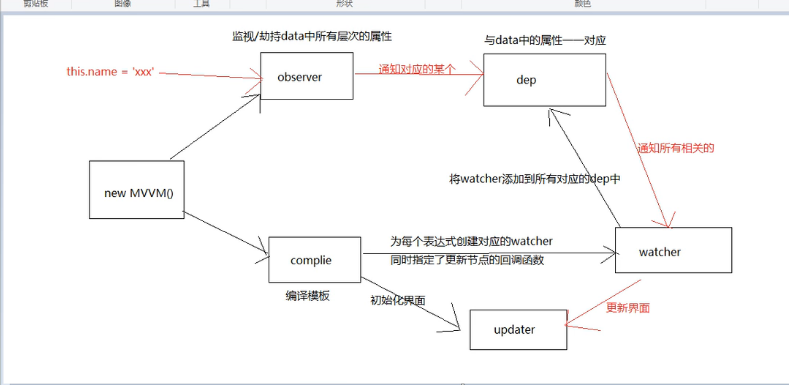
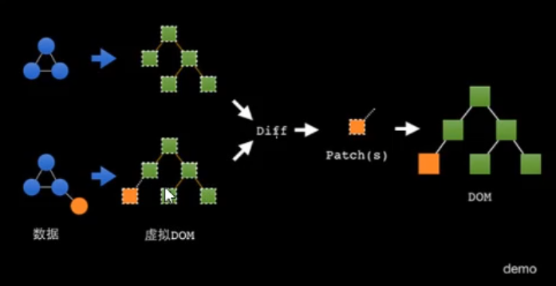
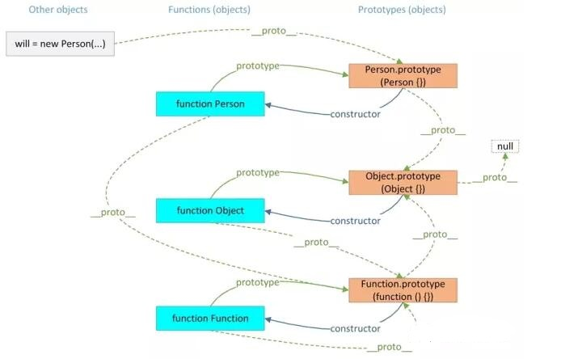

# 剑指offer

### 1. 为什么 JSON.parse(JSON.stringify(obj))能实现深拷贝

拷贝一个字符串，会新开辟一个存储地址，切断了对象的指针联系 

### 2. JSON.parse(JSON.stringify(obj))深拷贝的弊端

（1）当对象里有函数时或undefined，函数或undefined会丢失

（2）当对象里有NaN,Infinity时，序列化会转为null

（3）当对象里有时间对象new Date()时，序列化会得到时间字符串，而非时间对象

::: tip 提示
当遇到上面这种情况，可以使用下面方法或者lodash的cloneDeep方法
:::

```js
function deepClone(data) {
  const type = this.judgeType(data)
  let obj = null
  if (type == 'array') {
    obj = []
    for (let i = 0; i < data.length; i++) {
      obj.push(this.deepClone(data[i]))
    }
  } else if (type == 'object') {
    obj = {}
    for (let key in data) {
      if (data.hasOwnProperty(key)) {
        obj[key] = this.deepClone(data[key])
      }
    }
  } else {
    return data
  }
  return obj
}

function judgeType(obj) {
  // tostring会返回对应不同的标签的构造函数
  const toString = Object.prototype.toString
  const map = {
    '[object Boolean]': 'boolean',
    '[object Number]': 'number',
    '[object String]': 'string',
    '[object Function]': 'function',
    '[object Array]': 'array',
    '[object Date]': 'date',
    '[object RegExp]': 'regExp',
    '[object Undefined]': 'undefined',
    '[object Null]': 'null',
    '[object Object]': 'object',
  }
  if (obj instanceof Element) {
    return 'element'
  }
  return map[toString.call(obj)]
}
```

### 3. 手写递归 求和 1 到 100

```js
function add(num) {
  if (num === 100) {
    return num
  }
  return add(num + 1) + num
}
add(1) // 5050
function add2(num) {
  if (num === 1) {
    return num
  }
  return add2(num - 1) + num
}
add2(100) // 5050
```

### 4. vue 父子组件生命周期顺序

1. 加载渲染过程

  父组件beforeCreate->父组件created->父组件`beforeMount`->子组件beforeCreate->子组件created->子组件beforeMount->子组件mounted->父组件mounted

2. 子组件更新过程

  父组件beforeUpdate->子组件beforeUpdate->子组件updated->父组件updated

3. 父组件更新过程

  父组件beforeUpdate->父组件update

4. 销毁过程

  父组件beforeDestroy->子组件beforeDestroy->子组件destroyed->父组件destroyed

### 5. px 转 rem

浏览器默认字号16px，1rem=16px,为了方便计算设置html，font-size: 62.5%; 1rem = 10px
19.2设计图为1920
document.documentElement.style.fontSize = document.documentElement.clientWidth / 19.2 + 'px';

设计图10px;css：0.1rem

pxtorem插件

### 6. computed 和 watch 的区别

  computed`可缓存`，`可依赖多个属性`,当他的属性值发生变化时，下一次获取computed值时，
  才会计算computed的值，computed是模板表达式的声明式描述，会创建新的响应式数据。
  watch，是监听响应式数据的变化，watch 则更适用于`异步或开销大`的操作。

### 7. vue 权限控制

  导航守卫里先拿到当前登录人的角色，然后根据角色匹配路由表，这里需要递归过滤路由表，得到对应路由表后，
  在导航守卫里通过router.addRoutes动态添加符合条件的路由

### 8. Promise 相关

1. 为什么要用 promise？

  支持链式调用，可以解决回调地狱问题，promise指定回调函数的方式更加灵活

2. 什么是回调地狱？

  回调函数嵌套调用，外部回调函数异步执行结果是嵌套的回调函数的执行条件

3. 回调地狱的缺点

  不便于阅读，不便于异常处理

4. Promise.all方法

  Promise.all()方法接收一个数组作为参数，当数组的所有的Promise都为resolve状态， Promise.all()才会成功，若有一个失败，都会被认为是失败的

### 9. call、apply、bind 三种方法的用法和区别

1. call、apply、bind都是改变this指向的方法，第一个参数都是指定函数内部中this的指向
2. call和apply都是`立即执行函数`，apply第二个参数用数组接受，call，后面可以接收多个参数
3. bind方法没有立即执行，因为bind返回的是一个函数

### 10. vue 双向绑定原理

1. 通过数据劫持结合发布订阅模式来实现，具体数据劫持通过Object.defineProperty()来实现数据劫持
2. 实现一个解析器Compile，可以扫描和解析每个节点的相关指令，并根据初始化模板数据以及初始化相应的订阅器。
3. 实现一个监听器Observer，用来劫持并监听所有属性，如果有变动的，就通知订阅者。
4. 实现一个订阅者Watcher，可以收到属性的变化通知并执行相应的函数，从而更新视图。

<!--  -->


### 11. Vuex 如何做持久化存储

存到缓存里，或者使用`vuex-persist`插件

### 12. props 和 data 优先级谁高？

props ===> methods ===> data ===> computed ===>watch

### 13. js 的数据类型有哪些？如何检测数据类型？如何判断引用类型？

1. 基本数据类型：`Number、String、Boolean、Null、Undefined`
2. 引用类型：` Object、Array、Function`
3. `typeof` 常用于检测基本类型(Number、String、Boolean、Undefined)，`===`可以判断 null,undefined,`instanceof` 常用于检测复杂类型(引用类型)
4. 扩展：`instanceof`是如何判断的？ 表达式 A instanceof B
   如果 B 的显示原型对象在 A 的原型链上，则返回 true, 否则返回 false

### 14. let & const 与 var 的区别？

1. var存在`变量提升`，可重复声明同一变量，声明的变量均可改
2. let没有变量提升，不可重复声明同一变量，声明的变量均可改
3. const没有变量提升，不可重复声明同一变量，声明的基本数据类型不可改，引用类型可改属性，不可只声明变量而不赋值

### 15. includes 比 indexOf 好在哪？

includes可以检测NaN，indexOf不能检测NaN，includes内部使用了Number.isNaN对NaN进行了匹配

### 16. 什么是 async/await？解决了什么问题？

是`generator` + `Promise`的语法糖，主要的作用是用同步方式执行异步操作，await只能在async函数中使用，async函数执行会返回一个Promise，值由函数的return值所决定

### 17. new 操作符为什么能创建一个实例对象？

  分析一下new的整个过程：

  1、创建一个空对象

  2、继承构造函数的原型

  3、this指向obj，并调用构造函数

  4、返回对象

```js
// 简单实现下new：
function myNew(fn, ...args) {
  // 第一步：创建一个空对象
  const obj = {}

  // 第二步：继承构造函数的原型
  obj.__proto__ = fn.prototype

  // 第三步：this指向obj，并调用构造函数
  fn.apply(obj, args)

  // 第四步：返回对象
  return obj
}
```

### 18. 什么是函数柯里化？简单实现一个？

是把接受多个参数的函数变换成接受一个单一参数（最初函数的第一个参数）的函数，并且返回接受余下的参数而且返回结果的新函数的技术。

```js
// 普通的add函数
function add(x, y) {
  return x + y
}

// Currying后
function curryingAdd(x) {
  return function (y) {
    return x + y
  }
}

add(1, 2) // 3
curryingAdd(1)(2) // 3
```

::: tip 好处

1. 参数复用

2. 延迟执行 其实 Function.prototype.bind 就是科里化的实现例子
:::

### 19. 箭头函数与普通函数的区别？

1. 箭头函数不能作为构造函数，不能 new
2. 箭头函数没有自己的 this
3. 箭头函数没有 arguments 对象
4. 箭头函数没有原型对象

### 20. forEach 如何跳出循环？

```js
function getItemById(arr, id) {
  var item = null
  try {
    arr.forEach(function (curItem, i) {
      console.log(i)
      if (curItem.id == id) {
        item = curItem
        throw Error()
      }
    })
  } catch (e) {}
  return item
}
```

### 21. 了解 BFC 吗？

1. 块级格式化上下文。
2. BFC 的原则：如果一个元素具有 BFC，那么内部元素再怎么弄，都不会影响到外面的元素。
3. 如何触发 BFC：
   float 的值非 none
   overflow 的值非 visible
   display 的值为：inline-block、table-cell...
   position 的值为:absoute、fixed

### 22. 什么是虚拟 DOM？

其实就是数据，把 dom 变成数据结构,用一个 JS 对象来描述一个真实 DOM 结构,大大节省了浏览器损耗。

### 23. diff 算法

利用 diff 算法可以更多提升 dom 之间对比的性能（采用虚拟 dom 数据进行对比）。

当虚拟DOM的某个节点发生了变化，会生成一个新的VNode，然后通过新的VNode与之前的旧的VNode进行对比，把不同的地方修改在真实的DOM上，在将旧的VNode更新节点的值。
diff过程的核心就是去使用patch函数，对比新老节点，然后修改真实DOM。




### 24. 前端路由模式？

**1. Hash 模式**
通过监听 `hashchange` 事件来监听页面 hash 的变化，通过解析 hash 的值来切换页面。

**优点：** 兼容性最佳，无需服务端配置。

**缺点：** 服务端无法获取 hash 部分内容, 可能和锚点冲突，SEO 不友好

**2. History 模式**

History 路由核心主要依赖 History API 里的两个方法和一个事件，其中两个方法用于操作浏览器的历史记录，事件用于监听历史记录的切换

**方法：**

`history.pushState`：将给定的 Data 添加到当前标签页的历史记录栈中。
`history.replaceState`：将给定的 Data 更新到历史记录栈中最新的一条记录中。

**事件：**

`popstate`：监听历史记录的变化。

**优点：** 服务端可获取完整的链接和参数。前端监控友好,SEO 相对 Hash 路由友好。

**缺点：** 兼容性稍弱,需要服务端额外配置（各 path 均指向同一个 HTML）。

### 25. 显式原型和隐式原型，原型链

1. 每个函数 function 都有一个 `prototype` 属性，即显示原型(属性)，定义函数时自动添加
2. 每个实例对象都有一个`__proto__`，即隐式原型(属性)，创建对象时自动添加
3. 对象的隐式原型的值 对应其构造函数的显示原型的值
4. 那条被 `__proto__` 链接起来的链式关系，就称为`原型链`

<!--  -->


**原型链继承**：
让子类的原型指向父类的实例

**构造函数继承**：
在子类的构造函数中执行父类的构造函数，改变this的指向

**组合式继承**：
把原型链继承和构造函数继承结合起来就形成了组合式继承

**ES6 Class的继承**：
Class 可以通过extends关键字实现继承，让子类继承父类的属性和方法。子类必须在constructor()方法中调用super()得到与父类同样的实例属性和方法

### 26. 浏览器从输入网址到页面展示的过程

1. URL 输入
2. DNS 解析
3. 建立 TCP 连接 (三次握手)
4. 发送 HTTP / HTTPS 请求（建立 TLS 连接）
5. 服务器响应请求
6. 浏览器解析渲染页面

   6.1 处理 HTML 标记并构建 DOM 树。

   6.2 处理 css 标记并标记 cssom 树。

   6.3 将 DOM 树和 cssom 树合成一个渲染树。

   6.4 根据渲染树来布局。

   6.5 将各个节点绘制到屏幕上
7. HTTP 请求结束，断开 TCP 连接 （4 次挥手）

### 27. 宏任务和微任务和事件循环机制

**异步任务**：分为宏任务和微任务

**宏任务**：settimeout, setinterval，script

1. 宏任务所处的队列就是宏任务队列。
2. 第一个宏任务队列只有一个任务：执行主线程的 js 代码（`先宏后微`）
3. 宏任务队列可以有多个
4. 当宏任务队列中的任务都执行完以后会查看是否有微任务队列，如果有，执行微任务队列中的所有任务，如果没有查看是否有宏任务队列如果有执行下一个宏任务

**微任务**：new Promise().then(), nodejs 的 process.nextTick，await

1. 微任务所处的队列就是微任务对列。
2. 只有一个微任务队列
3. 在上一个宏任务队列执行完毕后如果有微任务队列就会执行微任务队列中的所有任务

**事件循环**：主线程从任务队列中读取事件，这个过程是循环不断的，这种运行机制被称为事件循环。

**运行机制**：先执行同步任务，遇到`异步宏任务`放到`宏任务队列`，遇到`异步微任务`放到`微任务队列`,当同步代码执行完后，再将异步微任务调入主线程执行，微任务执行完成后，将异步宏任务调入主线程执行，一直循环至所有任务都执行完成。

### 28. 闭包的作用和原理

1. 作用：能够在函数作用域外，使用函数定义的作用域内的变量，并且不会污染全局，(函数嵌套)。
2. 原理：基于词法作用域链和垃圾回收机制，通过维持函数作用域的引用，让函数作用域可以在当前作用域外被访问到。
3. 优点：延长外部函数局部变量的生命周期
4. 缺点：容易造成内存泄漏
5. 注意点: 1. 合理使用闭包 2. 用完闭包也要及时清除，销毁

### 29. 手写节流防抖，bind

```js
// 防抖
function debounce(fn, delay) {
  let timer = null
  return () => {
    if (timer) clearTimeout(timer)
    timer = setTimeout(fn, delay)
  }
}
// 节流
function throttle(fn, delay) {
  let timer = null
  return () => {
    if (!timer) {
      timer = setTimeout(() => {
        fn()
        timer = null
      }, delay)
    }
  }
}
// 自定义的 bind 绑定
Function.prototype.binder = function(context) {
    var fn = this;
    var args = [].slice.call(arguments, 1);

    return function() {
        return fn.apply(context, args);
    };
};
function getNm(name) {
  console.log(name)
}
let obj = {};
getNm.binder(obj, 'myBind')(); // 'myBind'
```

### 30. 性能优化

1. 减少 http 请求，雪碧图等
2. 减小文件大小，Gzip 服务端打包压缩
3. 大图，大文件放到 CDN 库，链接引入
4. 减少 dom 操作
5. 懒加载，减少首屏加载量

### 31. js 垃圾回收机制

1. 创建一个变量时，会自动分配内存空间，当变量不再被使用时，垃圾回收机制会自动释放相应的内存

### 32. 数组去重
```js
// 1
let arr = [1,1,2,3];
arr = [...new Set(arr)];
// 2
let arr2 = [];
arr.forEach(v => {
  if(!arr2.includes(v)) {
    arr2.push(v);
  }
})
```
### 33. vue 组件中的 data 为什么必须是函数 
因为每一个 vue 组件都是一个 vue 实例，通过 new Vue() 实例化，引用同一个对象，如果 data 直接是一个对象的话，那么一旦修改其中一个组件的数据，其他组件相同数据就会被改变，而 data 是函数的话，每个 vue 组件的 data 都因为函数有了自己的`作用域`，互不干扰。

### 34. rem 与 em的区别

**rem** 根据 W3C 规范可知，1rem 等同于根元素 html 的 font-size 大小

```html
<style type="text/css">
  html {
    font-size: 12px;
  }
  .box {
    font-size: 2rem; /*相当于 24px*/
    width: 10rem; /*同理*/
    height: 10rem; /*同理*/
  }
</style>
```

**em** 字体大小是根据父元素字体大小设置的

```html
<style type="text/css">
  html {
    font-size: 12px;
  }
  .box {
    font-size: 2em; /*box的父元素是html，2em=12*2 = 24px*/
    width: 10em; /*同理*/
    height: 10em; /*同理*/
  }
  .innerBox {
    font-size: 3em; /*innerBox的父元素是box,box的字体大小是24px，3em = 3*24 = 72px*/
  }
</style>

<body>
  <div class="box">
    <div class="innerBox"></div>
  </div>
</body>
```

###  35. 元素垂直居中的方式

1.使用绝对定位并margin自适应进行居中
```html
<style type="text/css">
#father{
  position:relative;
}
#son{
  position: absolute;
  left: 0;
  top: 0;
  right: 0;
  bottom: 0;
  margin:auto;
}
</style>
```
2. 使用弹性盒子来实现居中
```html
<style type="text/css">
 #father{
  display: flex;
  justify-content: center;
  align-items: center;
}
</style>
```
3. position配合transform
```html
<style type="text/css">
 #father {
  background-color: orange;
  height: 200px;
  width: 500px;
  position: relative;
}
#son {
  background-color: green;
  width: 150px;
  position:absolute;
  top:50%;
  left:50%;
  transform: traslate(-50%, -50%);
}
</style>
```

4. 使用table-cell进行居中显示

```html
<style type="text/css">
/*关键样式代码*/
 #father{
  display: table-cell;
  vertical-align: middle;
}
#son{
  margin: 0 auto;
}
</style>
```

### 36.js数组的方法有哪些，哪些可以改变原数组，哪些不改变原数组

#### 一、改变原始数组的方法
**1、pop()**

删除 arrayObject 的最后一个元素，把数组长度减 1，并且返回它删除的元素的值。如果数组已经为空，则 pop() 不 改变数组，并返回 undefined 值。arrayObject.pop() 。

**2、push()**

　　push() 方法可把它的参数顺序添加到 arrayObject 的尾部。它直接修改 arrayObject，而不是创建一个新的数组，arrayObject.push(newelement1,newelement2,….,newelementX) 。

**3、reverse()**

　　该方法会改变原来的数组----将原来的数组倒序，而不会创建新的数组。arrayObject.reverse()。

**4、shift()**

　　删除数组的第一个元素，并返回第一个元素的值,如果数组是空的，那么 shift() 方法将不进行任何操作。

**5、unshift()**

　　unshift() 方法可向数组的开头添加一个或更多元素，并返回新的长度。arrayObject.unshift(newelement1,newelement2,….,newelementX)返回arrayObject 的新长度。

**6、sort()**

　　对数组的引用。请注意，数组在原数组上进行排序，不生成副本。arrayObject.sort(sortby) (如果调用该方法时没有使用参数，将按字母顺序对数组中的元素进行排序，说得更精确点，是按照字符编码的顺序进行排序。要实现这一点，首先应把数组的元素都转换成字符串（如有必要），以便进行比较。 
　　如果想按照其他标准进行排序，就需要提供比较函数，该函数要比较两个值，然后返回一个用于说明这两个值的相对顺序的数字。比较函数应该具有两个参数 a 和 b，其返回值如下：

若 a 小于 b，在排序后的数组中 a 应该出现在 b 之前，则返回一个小于 0 的值。 
若 a 等于 b，则返回 0。 
若 a 大于 b，则返回一个大于 0 的值。) 

**7、splice()**

　　splice() 方法可删除从 index 处开始的零个或多个元素，并且用参数列表中声明的一个或多个值来替换那些被删除的元素。 如果从 arrayObject 中删除了元素，则返回的是含有被删除的元素的数组 arrayObject.splice(index,howmany,item1,…..,itemX) 。

#### 二、不改变原始数组的方法

**1、concat()**

　　用于连接两个或多个数组，仅会返回被连接数组的一个副本，arrayObject.concat(arrayX,arrayX,……,arrayX) 。

**2、join()**

　　返回一个字符串。该字符串是通过把 arrayObject 的每个元素转换为字符串，然后把这些字符串连接起来,arrayObject.join(separator) 。

**3、slice()**

　　arrayObject.slice(start,end)返回一个新的数组，包含从 start 到 end （不包括该元素）的 arrayObject 中的元素。


### 37. pc端跨系统跳转，保持登录状态

::: tip 考查单点登录（SSO） 

- 同域名下的单点登录
- 不同域名下的单点登录

:::

#### 什么是单点登录？
单点登录（Single Sign On），简称为 SSO。用户只需要登录一次就可以访问所有相互信任的应用系统

##### 一、同域名下的单点登录

`cookie`的`domin`属性设置为当前域的父域，并且父域的cookie会被子域所共享。`path`属性默认为web应用的上下文路径

利用 Cookie 的这个特点，没错，我们只需要将`Cookie`的`domain`属性设置为父域的域名（主域名），同时将 Cookie的`path`属性设置为根路径，将 `Session ID`（或 `Token`）保存到父域中。这样所有的子域应用就都可以访问到这个`Cookie`

```js
/**
   * Cookies.set传三个值，第一个是cookie的名称，第二个是设置token，第三个是路劲和cookie的域名
*/
Cookies.set(
  "name", //  设置cookie的名称
  "value",  //  设置token
  {
    path: "/",　//   这里不能把/去掉，否则会出现bug，可能导致找不到domain
    domain: "taikang"  //  设置主域名（关键点）
  }
)
```
**退出登录时**

```js
Cookies.set(
  "name", //  清除的cookie的名称
  null,
  {
    expires: -1,  //  有效期设置负数，cookie会自动清空
    path: "/",
    domain: "taikang"  //  主域名
  }
)
```

不过这要求应用系统的域名需建立在一个共同的主域名之下，如 `a.taikang.com` 和 `b.taikang.com`，它们都建立在 `taikang.com`这个主域名之下，那么它们就可以通过这种方式来实现单点登录

##### 二、不同域名下的单点登录

如果是不同域的情况下，Cookie是不共享的，这里我们可以部署一个`认证中心`，用于专门处理登录请求的独立的 Web服务

用户统一在认证中心进行登录，登录成功后，认证中心记录用户的登录状态，并将 token 写入 Cookie（`注意这个 Cookie是认证中心的，应用系统是访问不到的`）

应用系统检查当前请求有没有 Token，如果没有，说明用户在当前系统中尚未登录，那么就将页面跳转至认证中心

由于这个操作会将认证中心的 Cookie 自动带过去，因此，认证中心能够根据 Cookie 知道用户是否已经登录过了

如果认证中心发现用户尚未登录，则返回登录页面，等待用户登录

如果发现用户已经登录过了，就不会让用户再次登录了，而是会跳转回目标 URL，并在跳转前生成一个 Token，`拼接在目标URL` 的后面，回传给目标应用系统

应用系统拿到 Token之后，还需要向认证中心确认下 Token 的合法性，防止用户伪造。确认无误后，应用系统记录用户的登录状态，并将 Token写入Cookie，然后给本次访问放行。（注意这个 Cookie 是当前应用系统的）当用户再次访问当前应用系统时，就会自动带上这个 Token，应用系统验证 Token 发现用户已登录，于是就不会有认证中心什么事了

此种实现方式相对复杂，支持跨域，扩展性好，是单点登录的标准做法

:tada: :100: :100: :100:
