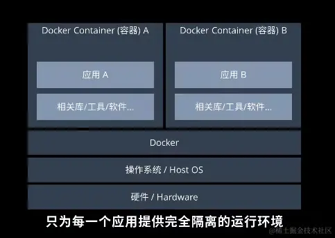
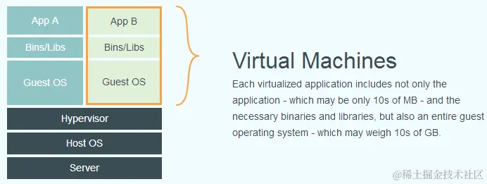
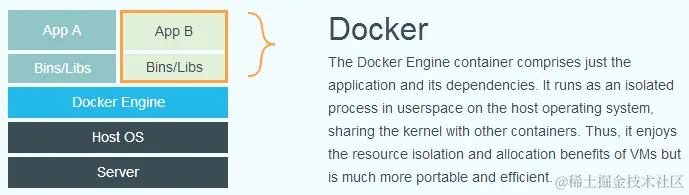
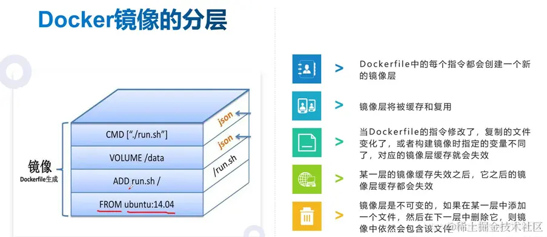

## 剖析 Promise 内部结构，一步一步实现一个完整的、能通过所有 Test case 的 Promise 类

::: details 点击查看

##### 本文适用的读者

本文写给有一定 Promise 使用经验的人，如果你还没有使用过 Promise，这篇文章可能不适合你，建议先了解 Promise 的使用

##### Promise 标准解读

1. 只有一个`then`方法，没有`catch`，`race`，`all`等方法，甚至没有构造函数

Promise 标准中仅指定了 Promise 对象的 then 方法的行为，其它一切我们常见的方法/函数都并没有指定，包括`catch`，`race`，`all`等常用方法，甚至也没有指定该如何构造出一个 Promise 对象，另外 then 也没有一般实现中（Q, $q 等）所支持的第三个参数，一般称 onProgress

2. `then`方法返回一个新的 Promise

Promise 的`then`方法返回一个新的 Promise，而不是返回 this，此处在下文会有更多解释

```js
promise2 = promise1.then(alert)
promise2 != promise1 // true
```

3. 不同 Promise 的实现需要可以相互调用(interoperable)

4. Promise 的初始状态为 pending，它可以由此状态转换为 fulfilled（本文为了一致把此状态叫做 resolved）或者 rejected，一旦状态确定，就不可以再次转换为其它状态，状态确定的过程称为 settle

##### 一步一步实现一个 Promise

下面我们就来一步一步实现一个 Promise

**构造函数**

因为标准并没有指定如何构造一个 Promise 对象，所以我们同样以目前一般 Promise 实现中通用的方法来构造一个 Promise 对象，也是 ES6 原生 Promise 里所使用的方式，即：

```js
// Promise构造函数接收一个executor函数，executor函数执行完同步或异步操作后，调用它的两个参数resolve和reject
var promise = new Promise(function (resolve, reject) {
  /*
    如果操作成功，调用resolve并传入value
    如果操作失败，调用reject并传入reason
  */
})
```

我们先实现构造函数的框架如下：

```js
function Promise(executor) {
  var self = this
  self.status = 'pending' // Promise当前的状态
  self.data = undefined // Promise的值
  self.onResolvedCallback = [] // Promise resolve时的回调函数集，因为在Promise结束之前有可能有多个回调添加到它上面
  self.onRejectedCallback = [] // Promise reject时的回调函数集，因为在Promise结束之前有可能有多个回调添加到它上面

  executor(resolve, reject) // 执行executor并传入相应的参数
}
```

上面的代码基本实现了 Promise 构造函数的主体，但目前还有两个问题：

&emsp;&emsp;1. 我们给 executor 函数传了两个参数：resolve 和 reject，这两个参数目前还没有定义

&emsp;&emsp;2. executor 有可能会出错（throw），类似下面这样，而如果 executor 出错，Promise 应该被其 throw 出的值 reject：

```js
new Promise(function (resolve, reject) {
  throw 2
})
```

所以我们需要在构造函数里定义 resolve 和 reject 这两个函数：

```js
function Promise(executor) {
  var self = this
  self.status = 'pending' // Promise当前的状态
  self.data = undefined // Promise的值
  self.onResolvedCallback = [] // Promise resolve时的回调函数集，因为在Promise结束之前有可能有多个回调添加到它上面
  self.onRejectedCallback = [] // Promise reject时的回调函数集，因为在Promise结束之前有可能有多个回调添加到它上面

  function resolve(value) {
    // TODO
  }

  function reject(reason) {
    // TODO
  }

  try {
    // 考虑到执行executor的过程中有可能出错，所以我们用try/catch块给包起来，并且在出错后以catch到的值reject掉这个Promise
    executor(resolve, reject) // 执行executor
  } catch (e) {
    reject(e)
  }
}
```

有人可能会问，resolve 和 reject 这两个函数能不能**不定义在构造函数里**呢？考虑到我们在 executor 函数里是以`resolve(value)`，`reject(reason)`的形式调用的这两个函数，而不是以`resolve.call(promise, value)`，`reject.call(promise, reason)`这种形式调用的，所以这两个函数在调用时的内部也必然有一个隐含的 this，也就是说，要么这两个函数是经过 bind 后传给了 executor，要么它们定义在构造函数的内部，使用 self 来访问所属的 Promise 对象。所以如果我们想把这两个函数定义在构造函数的外部，确实是可以这么写的：

```js
function resolve() {
  // TODO
}
function reject() {
  // TODO
}
function Promise(executor) {
  try {
    executor(resolve.bind(this), reject.bind(this))
  } catch (e) {
    reject.bind(this)(e)
  }
}
```

但是众所周知，bind 也会返回一个新的函数，这么一来还是相当于每个 Promise 对象都有一对属于自己的 resolve 和 reject 函数，就跟写在构造函数内部没什么区别了，所以我们就直接把这两个函数定义在构造函数里面了。不过话说回来，如果浏览器对 bind 的所优化，使用后一种形式应该可以提升一下内存使用效率。

**另外我们这里的实现并没有考虑隐藏 this 上的变量，这使得这个 Promise 的状态可以在 executor 函数外部被改变，在一个靠谱的实现里，构造出的 Promise 对象的状态和最终结果应当是无法从外部更改的。**

接下来，我们实现`resolve`和`reject`这两个函数

```js
function Promise(executor) {
  // ...

  function resolve(value) {
    if (self.status === 'pending') {
      self.status = 'resolved'
      self.data = value
      for (var i = 0; i < self.onResolvedCallback.length; i++) {
        self.onResolvedCallback[i](value)
      }
    }
  }

  function reject(reason) {
    if (self.status === 'pending') {
      self.status = 'rejected'
      self.data = reason
      for (var i = 0; i < self.onRejectedCallback.length; i++) {
        self.onRejectedCallback[i](reason)
      }
    }
  }

  // ...
}
```

基本上就是在判断状态为 pending 之后把状态改为相应的值，并把对应的 value 和 reason 存在 self 的 data 属性上面，之后执行相应的回调函数，逻辑很简单，这里就不多解释了。

##### `then`方法

Promise 对象有一个 then 方法，用来注册在这个 Promise 状态确定后的回调，很明显，then 方法需要写在原型链上。then 方法会返回一个 Promise，关于这一点，Promise/A+标准并没有要求返回的这个 Promise 是一个新的对象，但在 Promise/A 标准中，明确规定了 then 要返回一个新的对象，目前的 Promise 实现中 then 几乎都是返回一个新的 Promise 对象，所以在我们的实现中，也让 then 返回一个新的 Promise 对象。

关于这一点，我认为标准中是有一点矛盾的：

标准中说，如果`promise2 = promise1.then(onResolved, onRejected)`里的 onResolved/onRejected 返回一个 Promise，则 promise2 直接取这个 Promise 的状态和值为己用，但考虑如下代码：

```js
promise2 = promise1.then(function foo(value) {
  return Promise.reject(3)
})
```

此处如果`foo`运行了，则 promise1 的状态必然已经确定且为`resolve`d，如果 then 返回了 this（即`promise2 === promise1`），说明 promise2 和 promise1 是同一个对象，而此时 promise1/2 的状态已经确定，没有办法再取`Promise.reject(3)`的状态和结果为己用，因为 Promise 的状态确定后就不可再转换为其它状态。

另外每个 Promise 对象都可以在其上多次调用 then 方法，而每次调用 then 返回的 Promise 的状态取决于那一次调用 then 时传入参数的返回值，所以 then 不能返回 this，因为 then 每次返回的 Promise 的结果都有可能不同。

下面我们来实现 then 方法：

```js
// then方法接收两个参数，onResolved，onRejected，分别为Promise成功或失败后的回调
Promise.prototype.then = function (onResolved, onRejected) {
  var self = this
  var promise2

  // 根据标准，如果then的参数不是function，则我们需要忽略它，此处以如下方式处理
  onResolved = typeof onResolved === 'function' ? onResolved : function (v) {}
  onRejected = typeof onRejected === 'function' ? onRejected : function (r) {}

  if (self.status === 'resolved') {
    return (promise2 = new Promise(function (resolve, reject) {}))
  }

  if (self.status === 'rejected') {
    return (promise2 = new Promise(function (resolve, reject) {}))
  }

  if (self.status === 'pending') {
    return (promise2 = new Promise(function (resolve, reject) {}))
  }
}
```

Promise 总共有三种可能的状态，我们分三个 if 块来处理，在里面分别都返回一个 new Promise。

根据标准，我们知道，对于如下代码，promise2 的值取决于 then 里面函数的返回值：

```js
promise2 = promise1.then(
  function (value) {
    return 4
  },
  function (reason) {
    throw new Error('sth went wrong')
  },
)
```

如果 promise1 被 resolve 了，promise2 的将被`4` resolve，如果 promise1 被 reject 了，promise2 将被`new Error('sth went wrong')` reject，更多复杂的情况不再详述。

所以，我们需要在 then 里面执行 onResolved 或者 onRejected，并根据返回值(标准中记为 x)来确定 promise2 的结果，并且，如果 onResolved/onRejected 返回的是一个 Promise，promise2 将直接取这个 Promise 的结果：

```js
Promise.prototype.then = function (onResolved, onRejected) {
  var self = this
  var promise2

  // 根据标准，如果then的参数不是function，则我们需要忽略它，此处以如下方式处理
  onResolved =
    typeof onResolved === 'function' ? onResolved : function (value) {}
  onRejected =
    typeof onRejected === 'function' ? onRejected : function (reason) {}

  if (self.status === 'resolved') {
    // 如果promise1(此处即为this/self)的状态已经确定并且是resolved，我们调用onResolved
    // 因为考虑到有可能throw，所以我们将其包在try/catch块里
    return (promise2 = new Promise(function (resolve, reject) {
      try {
        var x = onResolved(self.data)
        if (x instanceof Promise) {
          // 如果onResolved的返回值是一个Promise对象，直接取它的结果做为promise2的结果
          x.then(resolve, reject)
        }
        resolve(x) // 否则，以它的返回值做为promise2的结果
      } catch (e) {
        reject(e) // 如果出错，以捕获到的错误做为promise2的结果
      }
    }))
  }

  // 此处与前一个if块的逻辑几乎相同，区别在于所调用的是onRejected函数，就不再做过多解释
  if (self.status === 'rejected') {
    return (promise2 = new Promise(function (resolve, reject) {
      try {
        var x = onRejected(self.data)
        if (x instanceof Promise) {
          x.then(resolve, reject)
        }
      } catch (e) {
        reject(e)
      }
    }))
  }

  if (self.status === 'pending') {
    // 如果当前的Promise还处于pending状态，我们并不能确定调用onResolved还是onRejected，
    // 只能等到Promise的状态确定后，才能确实如何处理。
    // 所以我们需要把我们的**两种情况**的处理逻辑做为callback放入promise1(此处即this/self)的回调数组里
    // 逻辑本身跟第一个if块内的几乎一致，此处不做过多解释
    return (promise2 = new Promise(function (resolve, reject) {
      self.onResolvedCallback.push(function (value) {
        try {
          var x = onResolved(self.data)
          if (x instanceof Promise) {
            x.then(resolve, reject)
          }
        } catch (e) {
          reject(e)
        }
      })

      self.onRejectedCallback.push(function (reason) {
        try {
          var x = onRejected(self.data)
          if (x instanceof Promise) {
            x.then(resolve, reject)
          }
        } catch (e) {
          reject(e)
        }
      })
    }))
  }
}

// 为了下文方便，我们顺便实现一个catch方法
Promise.prototype.catch = function (onRejected) {
  return this.then(null, onRejected)
}
```

至此，我们基本实现了 Promise 标准中所涉及到的内容，但还有几个问题：

1. 不同的 Promise 实现之间需要无缝的可交互，即 Q 的 Promise，ES6 的 Promise，和我们实现的 Promise 之间以及其它的 Promise 实现，应该并且是有必要无缝相互调用的，比如：

```js
// 此处用MyPromise来代表我们实现的Promise
new MyPromise(function (resolve, reject) {
  // 我们实现的Promise
  setTimeout(function () {
    resolve(42)
  }, 2000)
})
  .then(function () {
    return new Promise.reject(2) // ES6的Promise
  })
  .then(function () {
    return Q.all([
      // Q的Promise
      new MyPromise((resolve) => resolve(8)), // 我们实现的Promise
      new Promise.resolve(9), // ES6的Promise
      Q.resolve(9), // Q的Promise
    ])
  })
```

我们前面实现的代码并没有处理这样的逻辑，我们只判断了 onResolved/onRejected 的返回值是否为我们实现的 Promise 的实例，并没有做任何其它的判断，所以上面这样的代码目前是没有办法在我们的 Promise 里正确运行的。

2. 下面这样的代码目前也是没办法处理的：

```js
new Promise((resolve) => resolve(8))
  .then()
  .then()
  .then(function foo(value) {
    alert(value)
  })
```

正确的行为应该是 alert 出 8，而如果拿我们的 Promise，运行上述代码，将会 alert 出 undefined。这种行为称为穿透，即 8 这个值会穿透两个 then(说 Promise 更为准确)到达最后一个 then 里的 foo 函数里，成为它的实参，最终将会 alert 出 8。

##### 下面我们首先处理简单的情况，值的穿透

**Promise 值的穿透**

通过观察，会发现我们希望下面这段代码

```js
new Promise((resolve) => resolve(8))
  .then()
  .catch()
  .then(function (value) {
    alert(value)
  })
```

跟下面这段代码的行为是一样的

```js
new Promise((resolve) => resolve(8))
  .then(function (value) {
    return value
  })
  .catch(function (reason) {
    throw reason
  })
  .then(function (value) {
    alert(value)
  })
```

所以如果想要把 then 的实参留空且让值可以穿透到后面，意味着 then 的两个参数的默认值分别为`function(value) {return value}，function(reason) {throw reason}`。
所以我们只需要把 then 里判断`onResolved`和`onRejected`的部分改成如下即可：

```js
onResolved =
  typeof onResolved === 'function'
    ? onResolved
    : function (value) {
        return value
      }
onRejected =
  typeof onRejected === 'function'
    ? onRejected
    : function (reason) {
        throw reason
      }
```

**于是 Promise 神奇的值的穿透也没有那么黑魔法，只不过是 then 默认参数就是把值往后传或者抛**

**不同 Promise 的交互**

关于不同 Promise 间的交互，其实标准里是有说明的，其中详细指定了如何通过 then 的实参返回的值来决定 promise2 的状态，我们只需要按照标准把标准的内容转成代码即可。

这里简单解释一下标准：

即我们要把 onResolved/onRejected 的返回值，x，当成一个可能是 Promise 的对象，也即标准里所说的 thenable，并以最保险的方式调用 x 上的 then 方法，如果大家都按照标准实现，那么不同的 Promise 之间就可以交互了。而标准为了保险起见，即使 x 返回了一个带有 then 属性但并不遵循 Promise 标准的对象（比如说这个 x 把它 then 里的两个参数都调用了，同步或者异步调用（PS，原则上 then 的两个参数需要异步调用，下文会讲到），或者是出错后又调用了它们，或者 then 根本不是一个函数），也能尽可能正确处理。

关于为何需要不同的 Promise 实现能够相互交互，我想原因应该是显然的，Promise 并不是 JS 一早就有的标准，不同第三方的实现之间是并不相互知晓的，如果你使用的某一个库中封装了一个 Promise 实现，想象一下如果它不能跟你自己使用的 Promise 实现交互的场景。。。

建议各位对照着标准阅读以下代码，因为标准对此说明的非常详细，所以你应该能够在任意一个 Promise 实现中找到类似的代码：

```js
/*
resolvePromise函数即为根据x的值来决定promise2的状态的函数
也即标准中的[Promise Resolution Procedure](https://promisesaplus.com/#point-47)
x为`promise2 = promise1.then(onResolved, onRejected)`里`onResolved/onRejected`的返回值
`resolve`和`reject`实际上是`promise2`的`executor`的两个实参，因为很难挂在其它的地方，所以一并传进来。
相信各位一定可以对照标准把标准转换成代码，这里就只标出代码在标准中对应的位置，只在必要的地方做一些解释
*/
function resolvePromise(promise2, x, resolve, reject) {
  var then
  var thenCalledOrThrow = false

  if (promise2 === x) {
    // 对应标准2.3.1节
    return reject(new TypeError('Chaining cycle detected for promise!'))
  }

  if (x instanceof Promise) {
    // 对应标准2.3.2节
    // 如果x的状态还没有确定，那么它是有可能被一个thenable决定最终状态和值的
    // 所以这里需要做一下处理，而不能一概的以为它会被一个“正常”的值resolve
    if (x.status === 'pending') {
      x.then(function (value) {
        resolvePromise(promise2, value, resolve, reject)
      }, reject)
    } else {
      // 但如果这个Promise的状态已经确定了，那么它肯定有一个“正常”的值，而不是一个thenable，所以这里直接取它的状态
      x.then(resolve, reject)
    }
    return
  }

  if (x !== null && (typeof x === 'object' || typeof x === 'function')) {
    // 2.3.3
    try {
      // 2.3.3.1 因为x.then有可能是一个getter，这种情况下多次读取就有可能产生副作用
      // 即要判断它的类型，又要调用它，这就是两次读取
      then = x.then
      if (typeof then === 'function') {
        // 2.3.3.3
        then.call(
          x,
          function rs(y) {
            // 2.3.3.3.1
            if (thenCalledOrThrow) return // 2.3.3.3.3 即这三处谁选执行就以谁的结果为准
            thenCalledOrThrow = true
            return resolvePromise(promise2, y, resolve, reject) // 2.3.3.3.1
          },
          function rj(r) {
            // 2.3.3.3.2
            if (thenCalledOrThrow) return // 2.3.3.3.3 即这三处谁选执行就以谁的结果为准
            thenCalledOrThrow = true
            return reject(r)
          },
        )
      } else {
        // 2.3.3.4
        resolve(x)
      }
    } catch (e) {
      // 2.3.3.2
      if (thenCalledOrThrow) return // 2.3.3.3.3 即这三处谁选执行就以谁的结果为准
      thenCalledOrThrow = true
      return reject(e)
    }
  } else {
    // 2.3.4
    resolve(x)
  }
}
```

然后我们使用这个函数的调用替换 then 里几处判断 x 是否为 Promise 对象的位置即可，见下方完整代码。

最后，我们刚刚说到，原则上，promise.then(onResolved, onRejected)里的这两相函数需要异步调用，关于这一点，标准里也有说明：

> In practice, this requirement ensures that onFulfilled and onRejected execute asynchronously, after the event loop turn in which then is called, and with a fresh stack.

所以我们需要对我们的代码做一点变动，即在四个地方加上 setTimeout(fn, 0)，这点会在完整的代码中注释，请各位自行发现。

事实上，即使你不参照标准，最终你在自测试时也会发现如果 then 的参数不以异步的方式调用，有些情况下 Promise 会不按预期的方式行为，通过不断的自测，最终你必然会让 then 的参数异步执行，让 executor 函数立即执行。本人在一开始实现 Promise 时就没有参照标准，而是自己凭经验测试，最终发现的这个问题。

至此，我们就实现了一个的 Promise，完整代码如下：

```js
try {
  module.exports = Promise
} catch (e) {}

function Promise(executor) {
  var self = this

  self.status = 'pending'
  self.onResolvedCallback = []
  self.onRejectedCallback = []

  function resolve(value) {
    if (value instanceof Promise) {
      return value.then(resolve, reject)
    }
    setTimeout(function () {
      // 异步执行所有的回调函数
      if (self.status === 'pending') {
        self.status = 'resolved'
        self.data = value
        for (var i = 0; i < self.onResolvedCallback.length; i++) {
          self.onResolvedCallback[i](value)
        }
      }
    })
  }

  function reject(reason) {
    setTimeout(function () {
      // 异步执行所有的回调函数
      if (self.status === 'pending') {
        self.status = 'rejected'
        self.data = reason
        for (var i = 0; i < self.onRejectedCallback.length; i++) {
          self.onRejectedCallback[i](reason)
        }
      }
    })
  }

  try {
    executor(resolve, reject)
  } catch (reason) {
    reject(reason)
  }
}

function resolvePromise(promise2, x, resolve, reject) {
  var then
  var thenCalledOrThrow = false

  if (promise2 === x) {
    return reject(new TypeError('Chaining cycle detected for promise!'))
  }

  if (x instanceof Promise) {
    if (x.status === 'pending') {
      //because x could resolved by a Promise Object
      x.then(function (v) {
        resolvePromise(promise2, v, resolve, reject)
      }, reject)
    } else {
      //but if it is resolved, it will never resolved by a Promise Object but a static value;
      x.then(resolve, reject)
    }
    return
  }

  if (x !== null && (typeof x === 'object' || typeof x === 'function')) {
    try {
      then = x.then //because x.then could be a getter
      if (typeof then === 'function') {
        then.call(
          x,
          function rs(y) {
            if (thenCalledOrThrow) return
            thenCalledOrThrow = true
            return resolvePromise(promise2, y, resolve, reject)
          },
          function rj(r) {
            if (thenCalledOrThrow) return
            thenCalledOrThrow = true
            return reject(r)
          },
        )
      } else {
        resolve(x)
      }
    } catch (e) {
      if (thenCalledOrThrow) return
      thenCalledOrThrow = true
      return reject(e)
    }
  } else {
    resolve(x)
  }
}

Promise.prototype.then = function (onResolved, onRejected) {
  var self = this
  var promise2
  onResolved =
    typeof onResolved === 'function'
      ? onResolved
      : function (v) {
          return v
        }
  onRejected =
    typeof onRejected === 'function'
      ? onRejected
      : function (r) {
          throw r
        }

  if (self.status === 'resolved') {
    return (promise2 = new Promise(function (resolve, reject) {
      setTimeout(function () {
        // 异步执行onResolved
        try {
          var x = onResolved(self.data)
          resolvePromise(promise2, x, resolve, reject)
        } catch (reason) {
          reject(reason)
        }
      })
    }))
  }

  if (self.status === 'rejected') {
    return (promise2 = new Promise(function (resolve, reject) {
      setTimeout(function () {
        // 异步执行onRejected
        try {
          var x = onRejected(self.data)
          resolvePromise(promise2, x, resolve, reject)
        } catch (reason) {
          reject(reason)
        }
      })
    }))
  }

  if (self.status === 'pending') {
    // 这里之所以没有异步执行，是因为这些函数必然会被resolve或reject调用，而resolve或reject函数里的内容已是异步执行，构造函数里的定义
    return (promise2 = new Promise(function (resolve, reject) {
      self.onResolvedCallback.push(function (value) {
        try {
          var x = onResolved(value)
          resolvePromise(promise2, x, resolve, reject)
        } catch (r) {
          reject(r)
        }
      })

      self.onRejectedCallback.push(function (reason) {
        try {
          var x = onRejected(reason)
          resolvePromise(promise2, x, resolve, reject)
        } catch (r) {
          reject(r)
        }
      })
    }))
  }
}

Promise.prototype.catch = function (onRejected) {
  return this.then(null, onRejected)
}

Promise.deferred = Promise.defer = function () {
  var dfd = {}
  dfd.promise = new Promise(function (resolve, reject) {
    dfd.resolve = resolve
    dfd.reject = reject
  })
  return dfd
}
```

##### 测试

如何确定我们实现的 Promise 符合标准呢？Promise 有一个配套的测试脚本，只需要我们在一个 CommonJS 的模块中暴露一个 deferred 方法（即 exports.deferred 方法），就可以了，代码见上述代码的最后。然后执行如下代码即可执行测试：

```shell
npm i -g promises-aplus-tests
promises-aplus-tests Promise.js
```

##### 关于 Promise 的其它问题

**Promise 的性能问题**

可能各位看官会觉得奇怪，Promise 能有什么性能问题呢？并没有大量的计算啊，几乎都是处理逻辑的代码。

理论上说，不能叫做“性能问题”，而只是有可能出现的延迟问题。什么意思呢，记得刚刚我们说需要把 4 块代码包在 setTimeout 里吧，先考虑如下代码：

```js
var start = +new Date()
function foo() {
  setTimeout(function () {
    console.log('setTimeout')
    if (+new Date() - start < 1000) {
      foo()
    }
  })
}
foo()
```

运行上面的代码，会打印出多少次'setTimeout'呢，各位可以自己试一下，不出意外的话，应该是 250 次左右，我刚刚运行了一次，是 241 次。这说明，上述代码中两次 setTimeout 运行的时间间隔约是 4ms（另外，setInterval 也是一样的），实事上，这正是浏览器两次 Event Loop 之间的时间间隔，相关标准各位可以自行查阅。另外，在 Node 中，这个时间间隔跟浏览器不一样，经过我的测试，是 1ms。

单单一个 4ms 的延迟可能在一般的 web 应用中并不会有什么问题，但是考虑极端情况，我们有 20 个 Promise 链式调用，加上代码运行的时间，那么这个链式调用的第一行代码跟最后一行代码的运行很可能会超过 100ms，如果这之间没有对 UI 有任何更新的话，虽然本质上没有什么性能问题，但可能会造成一定的卡顿或者闪烁，虽然在 web 应用中这种情形并不常见，但是在 Node 应用中，确实是有可能出现这样的 case 的，所以一个能够应用于生产环境的实现有必要把这个延迟消除掉。在 Node 中，我们可以调用 process.nextTick 或者 setImmediate（Q 就是这么做的），在浏览器中具体如何做，已经超出了本文的讨论范围，总的来说，就是我们需要实现一个函数，行为跟 setTimeout 一样，但它需要异步且尽早的调用所有已经加入队列的函数，这里有一个实现。

**如何停止一个 Promise 链？**

在一些场景下，我们可能会遇到一个较长的 Promise 链式调用，在某一步中出现的错误让我们完全没有必要去运行链式调用后面所有的代码，类似下面这样（此处略去了 then/catch 里的函数）：

```js
new Promise(function (resolve, reject) {
  resolve(42)
})
  .then(function (value) {
    // "Big ERROR!!!"
  })
  .catch()
  .then()
  .then()
  .catch()
  .then()
```

假设这个`Big ERROR!!!`的出现让我们完全没有必要运行后面所有的代码了，但链式调用的后面即有 catch，也有 then，无论我们是`return`还是`throw`，都不可避免的会进入某一个`catch`或`then`里面，那有没有办法让这个链式调用在 Big ERROR!!!的后面就停掉，完全不去执行链式调用后面所有回调函数呢？

一开始遇到这个问题的时候我也百思不得其解，在网上搜遍了也没有结果，有人说可以在每个 catch 里面判断 Error 的类型，如果自己处理不了就接着 throw，也有些其它办法，但总是要对现有代码进行一些改动并且所有的地方都要遵循这些约定，甚是麻烦。

然而当我从一个实现者的角度看问题时，确实找到了答案，就是在发生 Big ERROR 后 return 一个 Promise，但这个 Promise 的 executor 函数什么也不做，这就意味着这个 Promise 将永远处于 pending 状态，由于 then 返回的 Promise 会直接取这个永远处于 pending 状态的 Promise 的状态，于是返回的这个 Promise 也将一直处于`pending`状态，后面的代码也就一直不会执行了，具体代码如下：

```js
new Promise(function (resolve, reject) {
  resolve(42)
})
  .then(function (value) {
    // "Big ERROR!!!"
    return new Promise(function () {})
  })
  .catch()
  .then()
  .then()
  .catch()
  .then()
```

这种方式看起来有些山寨，它也确实解决了问题。但它引入的一个新问题就是链式调用后面的所有回调函数都无法被垃圾回收器回收（在一个靠谱的实现里，Promise 应该在执行完所有回调后删除对所有回调函数的引用以让它们能被回收，在前文的实现里，为了减少复杂度，并没有做这种处理），但如果我们不使用匿名函数，而是使用函数定义或者函数变量的话，在需要多次执行的 Promise 链中，这些函数也都只有一份在内存中，不被回收也是可以接受的。

我们可以将返回一个什么也不做的 Promise 封装成一个有语义的函数，以增加代码的可读性：

```js
Promise.cancel = Promise.stop = function () {
  return new Promise(function () {})
}
```

然后我们就可以这么使用了：

```js
new Promise(function (resolve, reject) {
  resolve(42)
})
  .then(function (value) {
    // "Big ERROR!!!"
    return Promise.stop()
  })
  .catch()
  .then()
  .then()
  .catch()
  .then()
```

看起来是不是有语义的多？

**Promise 链上返回的最后一个 Promise 出错了怎么办？**

考虑如下代码：

```js
new Promise(function (resolve) {
  resolve(42)
}).then(function (value) {
  alter(value)
})
```

乍一看好像没什么问题，但运行这段代码的话你会发现什么现象也不会发生，既不会 alert 出 42，也不会在控制台报错，怎么回事呢。细看最后一行，`alert`被打成了`alter`，那为什么控制台也没有报错呢，因为`alter`所在的函数是被包在`try/catch`块里的，`alter`这个变量找不到就直接抛错了，这个错就正好成了 then 返回的 Promise 的 rejection reason。

也就是说，在 Promise 链的最后一个 then 里出现的错误，非常难以发现，有文章指出，可以在所有的 Promise 链的最后都加上一个 catch，这样出错后就能被捕获到，这种方法确实是可行的，但是首先在每个地方都加上几乎相同的代码，违背了 DRY 原则，其次也相当的繁琐。另外，最后一个 catch 依然返回一个 Promise，除非你能保证这个 catch 里的函数不再出错，否则问题依然存在。在 Q 中有一个方法叫 done，把这个方法链到 Promise 链的最后，它就能够捕获前面未处理的错误，这其实跟在每个链后面加上 catch 没有太大的区别，只是由框架来做了这件事，相当于它提供了一个不会出错的 catch 链，我们可以这么实现 done 方法：

```js
Promise.prototype.done = function () {
  return this.catch(function (e) {
    // 此处一定要确保这个函数不能再出错
    console.error(e)
  })
}
```

可是，能不能在不加 catch 或者 done 的情况下，也能够让开发者发现 Promise 链最后的错误呢？答案依然是肯定的。

我们可以在一个 Promise 被 reject 的时候检查这个 Promise 的 onRejectedCallback 数组，如果它为空，则说明它的错误将没有函数处理，这个时候，我们需要把错误输出到控制台，让开发者可以发现。以下为具体实现：

```js
function reject(reason) {
  setTimeout(function () {
    if (self.status === 'pending') {
      self.status = 'rejected'
      self.data = reason
      if (self.onRejectedCallback.length === 0) {
        console.error(reason)
      }
      for (var i = 0; i < self.rejectedFn.length; i++) {
        self.rejectedFn[i](reason)
      }
    }
  })
}
```

上面的代码对于以下的 Promise 链也能处理的很好：

```js
new Promise(function () {
  // promise1
  reject(3)
})
  .then() // returns promise2
  .then() // returns promise3
  .then() // returns promise4
```

看起来，promise1，2，3，4 都没有处理函数，那是不是会在控制台把这个错误输出 4 次呢，并不会，实际上，promise1，2，3 都隐式的有处理函数，就是 then 的默认参数，各位应该还记得 then 的默认参数最终是被 push 到了 Promise 的 callback 数组里。只有 promise4 是真的没有任何 callback，因为压根就没有调用它的 then 方法。

事实上，Bluebird 和 ES6 Promise 都做了类似的处理，在 Promise 被 reject 但又没有 callback 时，把错误输出到控制台。

Q 使用了 done 方法来达成类似的目的，$q 在最新的版本中也加入了类似的功能。

**Angular 里的$q 跟其它 Promise 的交互**

一般来说，我们不会在 Angular 里使用其它的 Promise，因为 Angular 已经集成了$q，但有些时候我们在Angular里需要用到其它的库（比如LeanCloud的JS SDK），而这些库或是封装了ES6的Promise，或者是自己实现了Promise，这时如果你在Angular里使用这些库，就有可能发现视图跟Model不同步。究其原因，是因为$q 已经集成了 Angular 的 digest loop 机制，在 Promise 被 resolve 或 reject 时触发 digest，而其它的 Promise 显然是不会集成的，所以如果你运行下面这样的代码，视图是不会同步的：

```js
app.controller(function ($scope) {
  Promise.resolve(42).then(function (value) {
    $scope.value = value
  })
})
```

Promise 结束时并不会触发 digest，所以视图没有同步。$q上正好有个when方法，它可以把其它的Promise转换成$q 的 Promise（有些 Promise 实现中提供了 Promise.cast 函数，用于将一个 thenable 转换为它的 Promise），问题就解决了：

```js
app.controller(function ($scope, $q) {
  $q.when(Promise.resolve(42)).then(function (value) {
    $scope.value = value
  })
})
```

当然也有其它的解决方案比如在其它 Promise 的链的最后加一个 digest，类似下面这样:

```js
Promise.prototype.$digest = function () {
  $rootScope.$digest()
  return this
}
// 然后这么使用
OtherPromise.resolve(42)
  .then(function (value) {
    $scope.value = value
  })
  .$digest()
```

因为使用场景并不多，此处不做深入讨论。

**出错时，是用 throw new Error()还是用 return Promise.reject(new Error())呢？**

这里我觉得主要从性能和编码的舒适度角度考虑：

性能方面，`throw new Error()`会使代码进入`catch`块里的逻辑（还记得我们把所有的回调都包在 try/catch 里了吧），传说`throw`用多了会影响性能，因为一但`throw`，代码就有可能跳到不可预知的位置。

但考虑到`onResolved/onRejected`函数是直接被包在 Promise 实现里的`try`里，出错后就直接进入了这个`try`对应 的`catch`块，代码的跳跃“幅度”相对较小，我认为这里的性能损失可以忽略不记。有机会可以测试一下。

而使用`Promise.reject(new Error())`，则需要构造一个新的 Promise 对象（里面包含 2 个数组，4 个函数：`resolve/reject`，`onResolved/onRejected`），也会花费一定的时间和内存。

而从编码舒适度的角度考虑，出错用`throw`，正常时用`return`，可以比较明显的区分出错与正常，`throw`和`return`又同为关键字，用来处理对应的情况也显得比较对称(-\_-)。另外在一般的编辑器里，`Promise.reject`不会被高亮成与`throw`和`return`一样的颜色。最后，如果开发者又不喜欢构造出一个`Error`对象的话，`Error`的高亮也没有了。

##### 最佳实践

这里不免再啰嗦两句最佳实践

1. 一是不要把 Promise 写成嵌套结构，至于怎么改进，这里就不多说了

```js
// 错误的写法
promise1.then(function (value) {
  promise1.then(function (value) {
    promise1.then(function (value) {})
  })
})
```

2. 二是链式 Promise 要返回一个 Promise，而不只是构造一个 Promise

```js
// 错误的写法
Promise.resolve(1)
  .then(function () {
    Promise.resolve(2)
  })
  .then(function () {
    Promise.resolve(3)
  })
```

##### Promise 相关的 convenience method 的实现

请到[这里](https://github.com/xieranmaya/Promise3)查看`Promise.race`, `Promise.all`, `Promise.resolve`, `Promise.reject`等方法的具体实现，这里就不具体解释了，总的来说，只要 then 的实现是没有问题的，其它所有的方法都可以非常方便的依赖 then 来实现。

##### 结语

搬运自[这里](https://github.com/xieranmaya/blog/issues/3)

:::

## Vue3.0 中为什么要用 Proxy Api 替代 defineProperty Api ?

::: details 点击查看

##### 一、Object.defineProperty

定义：Object.defineProperty() 方法会直接在一个对象上定义一个新属性，或者修改一个对象的现有属性，并返回此对象

###### 为什么能实现响应式

通过 defineProperty 两个属性，get 及 set

- get

属性的 getter 函数，当访问该属性时，会调用此函数。执行时不传入任何参数，但是会传入 this 对象（由于继承关系，这里的 this 并不一定是定义该属性的对象）。该函数的返回值会被用作属性的值

- set

属性的 setter 函数，当属性值被修改时，会调用此函数。该方法接受一个参数（也就是被赋予的新值），会传入赋值时的 this 对象。默认为 undefined

下面通过代码展示：

定义一个响应式函数`defineReactive`

```js
function update() {
  app.innerText = obj.foo
}

function defineReactive(obj, key, val) {
  Object.defineProperty(obj, key, {
    get() {
      console.log(`get ${key}:${val}`)
      return val
    },
    set(newVal) {
      if (newVal !== val) {
        val = newVal
        update()
      }
    },
  })
}
```

调用`defineReactive`，数据发生变化触发`update`方法，实现数据响应式

```js
const obj = {}
defineReactive(obj, 'foo', '')
setTimeout(() => {
  obj.foo = new Date().toLocaleTimeString()
}, 1000)
```

在对象存在多个`key`情况下，需要进行遍历

```js
function observe(obj) {
  if (typeof obj !== 'object' || obj == null) {
    return
  }
  Object.keys(obj).forEach((key) => {
    defineReactive(obj, key, obj[key])
  })
}
```

如果存在嵌套对象的情况，还需要在`defineReactive`中进行递归

```js
function defineReactive(obj, key, val) {
  observe(val)
  Object.defineProperty(obj, key, {
    get() {
      console.log(`get ${key}:${val}`)
      return val
    },
    set(newVal) {
      if (newVal !== val) {
        val = newVal
        update()
      }
    },
  })
}
```

当给`key`赋值为对象的时候，还需要在`set`属性中进行递归

```js
set(newVal) {
    if (newVal !== val) {
        observe(newVal) // 新值是对象的情况
        notifyUpdate()
    }
}
```

上述例子能够实现对一个对象的基本响应式，但仍然存在诸多问题

现在对一个对象进行删除与添加属性操作，无法劫持到

```js
const obj = {
  foo: 'foo',
  bar: 'bar',
}
observe(obj)
delete obj.foo // no ok
obj.jar = 'xxx' // no ok
```

当我们对一个数组进行监听的时候，并不那么好使了

```js
const arrData = [1, 2, 3, 4, 5]
arrData.forEach((val, index) => {
  defineProperty(arrData, index, val)
})
arrData.push() // no ok
arrData.pop() // no ok
arrDate[0] = 99 // ok
```

可以看到数据的`api`无法劫持到，从而无法实现数据响应式，

所以在`Vue2`中，增加了`set`、`delete` API，并且对数组`api`方法进行一个重写

还有一个问题则是，如果存在深层的嵌套对象关系，需要深层的进行监听，造成了性能的极大问题

###### 小结

- 检测不到对象属性的添加和删除
- 数组`API`方法无法监听到
- 需要对每个属性进行遍历监听，如果嵌套对象，需要深层监听，造成性能问题

##### 二、Proxy

`Proxy`的监听是针对一个对象的，那么对这个对象的所有操作会进入监听操作，这就完全可以代理所有属性了

在`ES6`系列中，我们详细讲解过`Proxy`的使用，就不再述说了

下面通过代码进行展示：

定义一个响应式方法`reactive`

```js
function reactive(obj) {
  if (typeof obj !== 'object' && obj != null) {
    return obj
  }
  // Proxy相当于在对象外层加拦截
  const observed = new Proxy(obj, {
    get(target, key, receiver) {
      const res = Reflect.get(target, key, receiver)
      console.log(`获取${key}:${res}`)
      return res
    },
    set(target, key, value, receiver) {
      const res = Reflect.set(target, key, value, receiver)
      console.log(`设置${key}:${value}`)
      return res
    },
    deleteProperty(target, key) {
      const res = Reflect.deleteProperty(target, key)
      console.log(`删除${key}:${res}`)
      return res
    },
  })
  return observed
}
```

测试一下简单数据的操作，发现都能劫持

```js
const state = reactive({
  foo: 'foo',
})
// 1.获取
state.foo // ok
// 2.设置已存在属性
state.foo = 'fooooooo' // ok
// 3.设置不存在属性
state.dong = 'dong' // ok
// 4.删除属性
delete state.dong // ok
```

再测试嵌套对象情况，这时候发现就不那么 OK 了

```js
const state = reactive({
  bar: { a: 1 },
})

// 设置嵌套对象属性
state.bar.a = 10 // no ok
```

如果要解决，需要在`get`之上再进行一层代理

```js
function reactive(obj) {
    if (typeof obj !== 'object' && obj != null) {
        return obj
    }
    // Proxy相当于在对象外层加拦截
    const observed = new Proxy(obj, {
        get(target, key, receiver) {
            const res = Reflect.get(target, key, receiver)
            console.log(`获取${key}:${res}`)
            return isObject(res) ? reactive(res) : res
        },
    return observed
}
```

##### 三、总结

`Object.defineProperty`只能遍历对象属性进行劫持

```js
function observe(obj) {
  if (typeof obj !== 'object' || obj == null) {
    return
  }
  Object.keys(obj).forEach((key) => {
    defineReactive(obj, key, obj[key])
  })
}
```

`Proxy`直接可以劫持整个对象，并返回一个新对象，我们可以只操作新的对象达到响应式目的

```js
function reactive(obj) {
  if (typeof obj !== 'object' && obj != null) {
    return obj
  }
  // Proxy相当于在对象外层加拦截
  const observed = new Proxy(obj, {
    get(target, key, receiver) {
      const res = Reflect.get(target, key, receiver)
      console.log(`获取${key}:${res}`)
      return res
    },
    set(target, key, value, receiver) {
      const res = Reflect.set(target, key, value, receiver)
      console.log(`设置${key}:${value}`)
      return res
    },
    deleteProperty(target, key) {
      const res = Reflect.deleteProperty(target, key)
      console.log(`删除${key}:${res}`)
      return res
    },
  })
  return observed
}
```

`Proxy`可以直接监听数组的变化（`push`、`shift`、`splice`）

```js
const obj = [1, 2, 3]
const proxtObj = reactive(obj)
obj.psuh(4) // ok
```

`Proxy`有多达 13 种拦截方法,不限于`apply`、`ownKeys`、`deleteProperty`、`has`等等，这是`Object.defineProperty`不具备的

正因为`defineProperty`自身的缺陷，导致`Vue2`在实现响应式过程需要实现其他的方法辅助（如重写数组方法、增加额外`set`、`delete`方法）

```js
// 数组重写
const originalProto = Array.prototype
const arrayProto = Object.create(originalProto)
['push', 'pop', 'shift', 'unshift', 'splice', 'reverse', 'sort'].forEach(method => {
  arrayProto[method] = function () {
    originalProto[method].apply(this.arguments)
    dep.notice()
  }
});

// set、delete
Vue.set(obj,'bar','newbar')
Vue.delete(obj),'bar')
```

`Proxy` 不兼容 IE，也没有 `polyfill`, `defineProperty` 能支持到 IE9

搬运自[这里](https://github.com/linwu-hi/code-interview/issues/97)
:::

## Docker 快速入门指南

::: details 点击查看

### 引言

前端掌握 Docker 要掌握到什么程度呢？其实只要能写 DockerFile 脚本就行了，至于深入原理和底层啊，看自己兴趣吧。毕竟 Go 我只会 CRUD，反正目前对于我来说足够用了，下面我来介绍一下 Docker 水文和分享我在项目中如何使用 Docker,反正就是`简单粗暴`,至于`k8s容器编排`,给我直接上腾讯云 ok,毕竟我只是一个切图仔，最复杂我也只会用`docker-compose`,那就开始 Docker 之旅吧

> 关于 install,自己去官网下载 Docker 桌面端就行了

### Docker 是什么？

Docker 是一种开源的应用容器引擎，它基于 Golang 语言开发，允许开发者将应用程序及其依赖打包到一个轻量级、可移植的容器中，然后发布到任何流行的 Linux 服务器。Docker 提供了一个供开发人员和系统管理员构建、运行和与容器共享应用程序的平台。使用 Docker 容器部署应用程序被称为容器化。虽然容器并不是新事物，但它们在轻松部署应用程序方面的应用却是新的。

### 为什么需要 Docker?

> Docker 的出现主要是为了解决以下问题：“在我的机器上运行正常，但为什么到你的机器上就运行不正常了？”。

例如，你编写了一个 Web 应用，并且在本地调试没有任何问题。然而，当你想让你的朋友试试看，或者想将其部署到远程的云服务器上查看效果时，你首先需要配置和你本地相同的软件环境，包括数据库、Web 服务器（如 IIS，Tomcat，Nginx）以及必要的插件和库等。但这样你仍然不能保证你的软件一定能够运行起来，因为别人可能使用的是完全不同的操作系统，即使是使用 Linux，每种发行版也会有微小的区别。

为了模拟完全相同的本地开发环境，我们首先想到的就是虚拟机。但是，虚拟机需要模拟硬件和运行整个操作系统，不仅体积大，内存占用高，而且程序的性能也会受到影响。

### Docker 的优势



### Docker 和虚拟机的区别

`Docker` 在容器的基础上，进行了进一步的封装，从文件系统、网络互联到进程隔离等等，极大的简化了容器的创建和维护。使得 `Docker`技术比虚拟机技术更为轻便、快捷。

下面的图片比较了  `Docker`  和传统虚拟化方式的不同之处。传统虚拟机技术是虚拟出一套硬件后，在其上运行一个完整操作系统，在该系统上再运行所需应用进程；而容器内的应用进程直接运行于宿主的内核，容器内没有自己的内核，而且也没有进行硬件虚拟。因此容器要比传统虚拟机更为轻便。





<table>
<tr>
  <th bgcolor=#60AC80 align=left>
  启动
  </th>
  <th bgcolor=#60AC80 align=left>
  秒级
  </th>
  <th bgcolor=#60AC80 align=left>
  分钟级
  </th>
</tr>
<tr>
  <td>
  硬盘使用
  </td>
  <td>
  一般为MB
  </td>
  <td>
  一般为GB
  </td>
</tr>
<tr>
  <td>
  性能
  </td>
  <td>
  接近原生(宿主机)
  </td>
  <td>
  弱于原生
  </td>
</tr>
<tr>
  <td>
  性能系统支持量
  </td>
  <td>
  单机支持上千个容器
  </td>
  <td>
  一般几十个
  </td>
</tr>
</table>

### Docker 中的重要概念

`Docker`中的三个重要概念分别是：`Image（镜像）`，`Container（容器）`，`Repository（仓储）`。

#### 镜像（Image）

Docker 镜像可以被认为是 Docker 容器的 "蓝图"。它包含了运行应用程序所需的所有元素，包括代码、运行时环境、库、环境变量和配置文件。镜像是只读的，容器在运行时创建的任何文件或对现有文件的任何修改都将写入容器的层，而不影响下面的镜像层。

镜像可以从 Dockerfile 创建，Dockerfile 是一个包含了创建镜像所需的指令的文本文件。你可以把 Dockerfile 看作是一个脚本，这个脚本包含了一组用来构建镜像的指令。

镜像还可以从已经存在的容器中创建，如果你对一个容器进行了修改，你可以提交这些修改来创建一个新的镜像。

Docker 中比较出名的镜像有:

- ubuntu: 最流行的 Linux 发行版之一
- alpine: 一个非常小巧（只有 5 MB）的 Linux 发行版，常被用于构建轻量级的 Docker 镜像
- nginx: 一个高性能的 HTTP 和反向代理服务器
- redis: 一个开源的使用 ANSI C 编写、支持网络、可基于内存亦可持久化的日志型、Key-Value 数据库
- mysql: 一个流行的开源关系数据库管理系统

#### 容器（Container）

如果说镜像是静态的 "蓝图"，那么容器就可以被认为是这个 "蓝图" 的一个运行实例。你可以启动、停止、删除或者查看容器的状态，也可以进入到一个正在运行的容器中，对其进行操作。

容器在启动时会创建一个可写的层（称为容器层），所有对容器的修改（如文件修改、新文件的创建等）都会写入到这个容器层，这个容器层是存在于镜像层之上的。

Docker 使用了一种称为联合文件系统（Union File System）的技术，允许多个文件系统（在这里是镜像层和容器层）联合挂载到同一个视点，从而形成一个单一的、一致的文件系统。

#### 仓库（Repository）

仓库是存放 Docker 镜像的地方。仓库允许你分享你的镜像，你可以将你的镜像推送（push）到仓库，也可以从仓库拉取（pull）其他人分享的镜像。

Docker 提供了一个公共的仓库 Docker Hub，你可以在 Docker Hub 上找到成千上万的由社区用户分享的镜像。此外，你也可以创建自己的私有仓库。

在企业环境中，为了安全和效率的考虑，通常会搭建私有 Docker 仓库。私有 Docker 仓库可以用来存放企业内部使用的镜像，确保敏感数据不会被外泄，并且可以提高镜像的下载速度。

### 常用的 Docker 命令

- **<span style="color:#60AC80">docker run</span>**: 用于从 Docker 镜像启动一个容器。例如，docker run -p 8080:80 -d my-app 将从名为 "my-app" 的 Docker 镜像启动一个新的容器，并将容器的 8080 端口映射到主机的 80 端口。

- **<span style="color:#60AC80">docker build</span>**: 用于从 Dockerfile 构建 Docker 镜像。例如，<span style="color:#60AC80">docker build -t my-app .</span> 将使用当前目录中的 Dockerfile 构建一个名为 "my-app" 的 Docker 镜像。

- **<span style="color:#60AC80">docker push</span>**: 用于将 Docker 镜像推送到 Docker Hub 或其他 Docker 注册服务器。例如，<span style="color:#60AC80">docker push my-app</span> 将名为 "my-app" 的 Docker 镜像推送到你的 Docker Hub 账户。

- **<span style="color:#60AC80">docker ps</span>**: 用于列出正在运行的 Docker 容器。添加 -a 选项（docker ps -a）可以列出所有容器，包括已停止的。

- **<span style="color:#60AC80">docker stop</span>**: 用于停止正在运行的 Docker 容器。例如，<span style="color:#60AC80">docker stop my-container</span> 将停止名为 "my-container" 的 Docker 容器。

- **<span style="color:#60AC80">docker rm</span>**: 用于删除 Docker 容器。例如，<span style="color:#60AC80">docker rm my-container</span>将删除名为 "my-container" 的 Docker 容器。

- **<span style="color:#60AC80">docker rmi</span>**: 用于删除 Docker 镜像。例如，<span style="color:#60AC80">docker rmi my-app</span> 将删除名为 "my-app" 的 Docker 镜像。

- **<span style="color:#60AC80">docker logs</span>**: 用于查看 Docker 容器的日志。例如，<span style="color:#60AC80">docker logs my-container</span> 将显示名为 "my-container" 的 Docker 容器的日志。

- **<span style="color:#60AC80">docker exec</span>**: 用于在正在运行的 Docker 容器中执行命令。例如，<span style="color:#60AC80">docker exec -it my-container bash</span> 将在名为 "my-container" 的 Docker 容器中启动一个 bash shell。

### 如何写 DockerFile

Dockerfile 是一个用于构建 Docker 镜像的文本文件，它包含了一系列的指令和参数，其实很简单的，会简单的 shell 脚本，理解 DockerFile 没有什么难度

```shell

# 使用官方 Node.js10镜像
FROM node:10

# 设置工作目录
WORKDIR /usr/src/app

# 将 package.json 和 package-lock.json 复制到工作目录
COPY package*.json ./

# 安装应用程序依赖项
RUN npm install

# 复制应用程序的所有文件到工作目录
COPY . .

# 开放端口 8080 供应用程序使用
EXPOSE 8080

# 定义 Docker 镜像运行的命令
CMD [ "node", "server.js" ]

```

> 下面是一些常见的 Dockerfile 指令

- **<span style="color:#60AC80">FROM</span>**: 这个指令定义了构建新镜像所基于的基础镜像。例如，如果你的应用是一个 Node.js 应用，你可能会使用 `FROM node:14` 作为你的 Dockerfile 的第一行。

```Dockerfile
FROM node:14
```

- **<span style="color:#60AC80">WORKDIR</span>**: 这个指令用于设置工作目录，或者说，接下来的指令（如 RUN、CMD、COPY、ADD 等）将在哪个目录下执行。

```Dockerfile
WORKDIR /app
```

- **<span style="color:#60AC80">COPY</span>**: 这个指令将从 Dockerfile 所在的目录中复制文件到镜像中。它有两个参数，源和目标。它通常用于将应用的源代码或应用所需的配置文件复制到镜像中。

```Dockerfile
COPY . .
```

- **<span style="color:#60AC80">ADD</span>**: 这个指令和 COPY 类似，都是将文件从 Dockerfile 所在的目录复制到镜像中。但是 ADD 更为强大，它允许源文件是一个 URL，或者在复制的过程中可以自动解压缩文件。
- **<span style="color:#60AC80">RUN</span>**: 这个指令用于执行任何被后面跟着的命令。这些命令在镜像构建时运行，并且它们的结果将会被包含到镜像中。这通常用于安装软件包。

```Dockerfile
RUN npm install
```

- **<span style="color:#60AC80">CMD</span>**: 这个指令用于提供默认的可执行命令，这些命令在镜像被运行（即，创建为一个容器）时执行。如果 Docker run 命令行中指定了其他命令，那么 CMD 指令将被忽略。

```Dockerfile
CMD [ "node", "server.js" ]
```

- **<span style="color:#60AC80">EXPOSE</span>**: 这个指令用于指明在运行时容器监听的端口。

```Dockerfile
EXPOSE 8080
```

- **<span style="color:#60AC80">ENV</span>**: 这个指令用于设置环境变量。这些变量以 key=value 的形式存在，可以在容器运行时被使用。

```Dockerfile
ENV NODE_ENV=production
```

- **<span style="color:#60AC80">ENTRYPOINT</span>**: 这个指令和 CMD 类似，都是在容器启动时执行的命令，但 ENTRYPOINT 的参数不会被 Docker run 命令行中的参数覆盖，而 CMD 的会。

其它指令去翻翻官方文档就行啦

### Docker 的分层设计

> 最后，了解一下 Docker 比较重要的设计概念

Docker 的分层设计是 Docker 强大功能的关键，这种设计让镜像的创建、复制和部署变得更为高效。

Docker 镜像是由多个只读层组成的。每个层都是前一层的增量更改，每个改变都会生成一个新的层。这种分层设计意味着，当你更改一个 Docker 镜像（比如更新应用程序的一个版本），新的 Docker 镜像只会生成包含更改部分的新层。新镜像其他的部分，比如操作系统或库，都会共享基础镜像的相应层。这使得镜像变得更小，构建更快，并且能更有效地利用磁盘空间。

当 Docker 镜像被运行为 Docker 容器时，Docker 会添加一个读写层到镜像的顶部。所有对运行容器的更改 - 无论是文件系统的修改，还是添加新文件，都会应用到这个可写层。这个读写层也被称为容器层。

Docker 使用 Union File System 来实现这种分层设计。Union File System 允许多个只读文件系统（Docker 的镜像层）与一个可写文件系统（容器层）被合并为一个单一的文件系统视图。这意味着，从容器内部看，所有的文件系统层看起来就像一个普通的、统一的文件系统。

Docker 的分层设计为 Docker 提供了许多强大的特性，包括镜像的快速构建和部署，以及容器之间的高效文件共享。



### Docker 项目实战

#### DockerFile

```shell
FROM nginx

ENV BASE=true

COPY ./dist /usr/share/nginx/html/

COPY ./nginx.conf /etc/nginx/conf.d/default.conf

COPY ./coding-time.cn_bundle.crt /etc/nginx/coding-time.cn_bundle.crt
COPY ./coding-time.cn_bundle.pem /etc/nginx/coding-time.cn_bundle.pem
COPY ./coding-time.cn.key /etc/nginx/coding-time.cn.key
COPY ./coding-time.cn.csr /etc/nginx/coding-time.cn.csr

```

#### depoly 脚本

```shell
#!/usr/bin/env sh

# 确保脚本抛出遇到的错误
set -e

git pull origin main

npm run docs:build


# 打包docker镜像之前把之前的先删除了 - 这里不用版本号管理了
sudo docker rmi coding-time -f
sudo docker rm coding-time-container -f

# 打包新的镜像
sudo docker build -t coding-time .


sudo docker run -itd -p 443:443 -p 80:80 --name coding-time-container coding-time

```

#### nginx 配置

```js
server {
        #SSL 默认访问端口号为 443
        listen 443 ssl;
        #请填写绑定证书的域名
        server_name www.coding-time.cn;
        #请填写证书文件的相对路径或绝对路径
        ssl_certificate  /etc/nginx/coding-time.cn_bundle.crt;
        #请填写私钥文件的相对路径或绝对路径
        ssl_certificate_key /etc/nginx/coding-time.cn.key;
        ssl_session_timeout 5m;
        #请按照以下套件配置，配置加密套件，写法遵循 openssl 标准。
        ssl_ciphers ECDHE-RSA-AES128-GCM-SHA256:ECDHE:ECDH:AES:HIGH:!NULL:!aNULL:!MD5:!ADH:!RC4;
        #请按照以下协议配置
        ssl_protocols TLSv1.2 TLSv1.3;
        ssl_prefer_server_ciphers on;
        location / {
            #网站主页路径。此路径仅供参考，具体请您按照实际目录操作。
            #例如，您的网站主页在 Nginx 服务器的 /etc/www 目录下，则请修改 root 后面的 html 为 /etc/www。
            root   /usr/share/nginx/html; # nginx的静态资源目录
            index  index.html index.htm;
            try_files $uri $uri/ /index.html; # 对于 Vue 或 React项目使用history路由需要
        }
    }

server {
        listen 80;
        #请填写绑定证书的域名
        server_name www.coding-time.cn;
        #charset koi8-r;
        access_log  /var/log/nginx/host.access.log  main;
        error_log  /var/log/nginx/error.log  error;
        location / {
            root   /usr/share/nginx/html; # nginx的静态资源目录
            index  index.html index.htm;
            try_files $uri $uri/ /index.html; # 对于 Vue 或 React项目使用history路由需要
        }
        #把http的域名请求转成https
        return 301 https://$host$request_uri;
    }

```

:::

## 多行展开收起效果的三种解决方案

::: details 点击查看
**方法一**

```css
.content {
  display: flex;
}
.text {
  width: 475px;
  border: aqua solid 1px;
  color: #333;
  font-size: 14px;
}
.text.show::before {
  content: '';
  float: right;
  height: 100%;
  margin-bottom: 40px;
}
.text.show .btn {
  display: block;
}
.btn {
  color: dodgerblue;
  cursor: pointer;
  float: right;
  clear: both;
  margin-right: 8px;
  display: none;
}

.ellipsis {
  display: -webkit-box;
  overflow: hidden;
  -webkit-line-clamp: 3;
  -webkit-box-orient: vertical;
}
#exp {
  display: none;
}
#exp:checked + .ellipsis {
  display: flex;
}
.btn::after {
  content: '展开';
}
#exp:checked + .ellipsis .btn::after {
  content: '收起';
}
#exp:checked + .ellipsis .text::before {
  margin-bottom: -20px;
}
```

```html
<input type="checkbox" id="exp" />
<div class="content ellipsis">
  <div class="text">
    <label class="btn" for="exp"></label>
    <span>
      但听得蹄声如雷，十余乘马疾风般卷上山来。马上乘客一色都是玄色薄毡大氅，
      里面玄色布衣，但见人似虎，马如龙，人既矫捷，马亦雄骏，每一匹马都是高头
      长腿，通体黑毛，奔到近处，群雄眼前一亮，金光闪闪，却见每匹马的蹄铁竟然
      是黄金打就。来者一共是一十九骑，人数虽不甚多，气势之壮，却似有如千军万
      马一般，前面一十八骑奔到近处，拉马向两旁一分，最后一骑从中驰出</span
    >
  </div>
</div>
```

```js
function getLineHeight(el) {
  var temp = document.createElement(el.nodeName),
    ret
  temp.setAttribute(
    'style',
    'margin:0; padding:0; ' +
      'font-family:' +
      (el.style.fontFamily || 'inherit') +
      '; ' +
      'font-size:' +
      (el.style.fontSize || 'inherit'),
  )
  temp.innerHTML = 'A'

  el.parentNode.appendChild(temp)
  ret = temp.clientHeight
  temp.parentNode.removeChild(temp)

  return ret
}
let el = document.querySelector('.content')
let text = document.querySelector('.text')
if (Math.round(el.clientHeight / getLineHeight(el)) >= 3) {
  text.classList.add('show')
}
```

**方法二**

```css
.wrapper {
  display: flex;
  margin: 50px auto;
  width: 800px;
  overflow: hidden;
  /*   resize: horizontal; */
  border-radius: 8px;
  padding: 15px;
  box-shadow: 20px 20px 60px #bebebe, -20px -20px 60px #ffffff;
}
.text {
  span-size: 20px;
  overflow: hidden;
  text-overflow: ellipsis;
  text-align: justify;
  /* display: flex; */
  /*   display: -webkit-box;
  -webkit-line-clamp: 3;
  -webkit-box-orient: vertical; */
  position: relative;
  line-height: 1.5;
  max-height: 4.5em;
  transition: 0.3s max-height;
}
.text::before {
  content: '';
  height: calc(100% - 26px);
  float: right;
}
.text::after {
  content: '';
  width: 999vw;
  height: 999vw;
  position: absolute;
  box-shadow: inset calc(100px - 999vw) calc(30px - 999vw) 0 0 #fff;
  margin-left: -100px;
}
.btn {
  position: relative;
  float: right;
  clear: both;
  margin-left: 20px;
  span-size: 16px;
  padding: 0 8px;
  background: #3f51b5;
  line-height: 24px;
  border-radius: 4px;
  color: #fff;
  cursor: pointer;
  /* margin-top: -30px; */
}
.btn::after {
  content: '展开';
}
.exp {
  display: none;
}
.exp:checked + .text {
  max-height: none;
}
.exp:checked + .text::after {
  visibility: hidden;
}
.exp:checked + .text .btn::before {
  visibility: hidden;
}
.exp:checked + .text .btn::after {
  content: '收起';
}
.btn::before {
  content: '...';
  position: absolute;
  left: -5px;
  color: #333;
  transform: translateX(-100%);
}
```

```html
<span class="wrapper">
  <input id="exp1" class="exp" type="checkbox" />
  <span class="text">
    <label class="btn" for="exp1"></label>
    浮动元素是如何定位的
    正如我们前面提到的那样，当一个元素浮动之后，它会被移出正常的文档流，然后向左或者向右平移，一直平移直到碰到了所处的容器的边框，或者碰到另外一个浮动的元素。
    在下面的图片中，有三个红色的正方形。其中有两个向左浮动，一个向右浮动。要注意到第二个向左浮动的正方形被放在第一个向左浮动的正方形的右边。如果还有更多的正方形这样浮动，它们会继续向右堆放，直到填满容器一整行，之后换行至下一行。
  </span>
</span>

<span class="wrapper">
  <input id="exp2" class="exp" type="checkbox" />
  <span class="text">
    <label class="btn" for="exp2"></label>
    浮动元素是如何定位的
    正如我们前面提到的那样，当一个元素浮动之后，它会被移出正常的文档流，然后向左或者向右平移，一直平移直到碰到了所处的容器的边框，或者碰到另外一个浮动的元素。
  </span>
</span>
```

**方法三**

```css
.container {
  padding: 50px;
}

.line-clamp {
  display: flex;
}

.line-clamp-content {
  max-height: 4.5em;
  line-height: 1.5;
  overflow: hidden;
  text-overflow: ellipsis;
  text-align: justify;
  position: relative;
}

.line-clamp-content::before {
  content: '';
  width: 0;
  float: right;
  height: calc(100% - 1.5em + 1px);
}

.line-clamp-content::after {
  content: '';
  position: absolute;
  width: 200vw;
  height: 100vh;
  box-shadow: inset -100vw calc(1.5em - 100vh) 0 0 #fff;
  margin-left: -100vw;
}

.line-clamp-btn {
  float: right;
  background-color: rgb(136, 110, 160);
  border-radius: 0.2em;
  padding: 0 0.2em;
  clear: both;
}

.line-clamp-btn > span {
  color: #fff;
}

.line-clamp-btn-open {
  margin-left: 1.3em;
  transform: translate(0, -1px);
  position: relative;
  cursor: pointer;
}

.line-clamp-btn-open::before {
  content: '...';
  transform: translate(-1.3em, 0);
  position: absolute;
}

.line-clamp-btn-close,
.line-clamp-checkbox,
.line-clamp-checkbox:checked + .line-clamp-content::before,
.line-clamp-checkbox:checked + .line-clamp-content::after,
.line-clamp-checkbox:checked + .line-clamp-content .line-clamp-btn-open {
  display: none;
}

.line-clamp-checkbox:checked + .line-clamp-content {
  max-height: inherit;
}

.line-clamp-checkbox:checked + .line-clamp-content .line-clamp-btn-close {
  display: inherit;
}
```

```html
<span class="container">
  <h1>纯css实现展开和收起</h1>
  <span class="line-clamp">
    <input type="checkbox" class="line-clamp-checkbox" id="checkbox" />
    <span class="line-clamp-content">
      <label for="checkbox" class="line-clamp-btn line-clamp-btn-open">
        <span>展开</span>
      </label>
      主要利用 float:right CSS属性
      指定元素应沿其容器的右侧放置，允许文本和内联元素环绕它。
      该元素从网页的正常流动(文档流)中移除，尽管仍然保持部分的流动性。
      然后利用另一个浮动元素把指定元素置于右下角，通过父容器
      display:flex（grid）的特性，flex项尺寸会根据内容自动计算，flex项子项可以使用百分比高度，获取到位置高度<code
        >calc(100% - 1.5em +1px)</code
      >
      加 1px 是为了避免计算出现小数高度不够。
      <label for="checkbox" class="line-clamp-btn line-clamp-btn-close">
        <span>收起</span>
      </label>
    </span>
  </span>
</span>
```

:::

